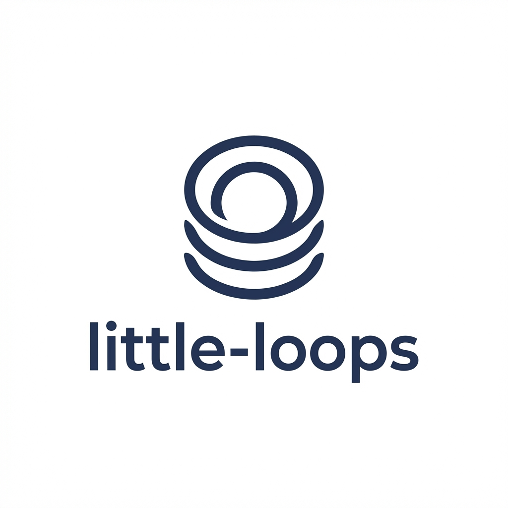

<p align="center">
  
</p>

# little-loops

Development workflow toolkit for Claude Code with issue management, code quality commands, and automated processing.

## Overview

little-loops is a Claude Code plugin that provides a complete development workflow toolkit. It includes:

- **15 slash commands** for development workflows
- **4 specialized agents** for codebase analysis
- **Automation scripts** for autonomous issue processing
- **Configuration system** for project customization

## Installation

### From GitHub (recommended)

```bash
# Add the GitHub repository as a marketplace
/plugin marketplace add github:BrennonTWilliams/little-loops

# Install the plugin
/plugin install ll@little-loops
```

### From local path (development)

```bash
# Add the local directory as a marketplace (alias derived from plugin.json name)
/plugin marketplace add /path/to/little-loops

# Install the plugin
/plugin install ll
```

### Manual configuration

Add to your project's `.claude/settings.local.json`:

```json
{
  "extraKnownMarketplaces": {
    "local": {
      "source": {
        "source": "directory",
        "path": "/path/to/little-loops"
      }
    }
  },
  "enabledPlugins": {
    "ll@local": true
  }
}
```

## Quick Start

1. **Initialize configuration** (recommended):

```bash
# Auto-detect project type and generate config
/ll:init

# Or use interactive wizard for full customization
/ll:init --interactive

# Or accept all defaults without prompts
/ll:init --yes
```

This detects your project type (Python, Node.js, Go, Rust, Java, .NET) and creates `.claude/ll-config.json` with appropriate defaults.

2. **Use commands**:

```bash
# Check code quality
/ll:check_code all

# Run tests
/ll:run_tests unit

# Manage issues
/ll:manage_issue bug fix BUG-001
```

3. **Run automation** (requires Python package):

```bash
# Install CLI tools (use the path to your little-loops installation)
pip install /path/to/little-loops/scripts

# Process issues automatically
ll-auto --max-issues 5
```

## Configuration

little-loops uses `.claude/ll-config.json` for project-specific settings. All settings have sensible defaults.

### Full Configuration Example

```json
{
  "$schema": "./config-schema.json",

  "project": {
    "name": "my-project",
    "src_dir": "src/",
    "test_cmd": "pytest tests/",
    "lint_cmd": "ruff check src/",
    "type_cmd": "mypy src/",
    "format_cmd": "ruff format src/",
    "build_cmd": null
  },

  "issues": {
    "base_dir": ".issues",
    "categories": {
      "bugs": { "prefix": "BUG", "dir": "bugs", "action": "fix" },
      "features": { "prefix": "FEAT", "dir": "features", "action": "implement" },
      "enhancements": { "prefix": "ENH", "dir": "enhancements", "action": "improve" }
    },
    "completed_dir": "completed",
    "priorities": ["P0", "P1", "P2", "P3", "P4", "P5"],
    "templates_dir": null
  },

  "automation": {
    "timeout_seconds": 3600,
    "state_file": ".auto-manage-state.json",
    "worktree_base": ".worktrees",
    "max_workers": 2,
    "stream_output": true
  },

  "parallel": {
    "max_workers": 2,
    "p0_sequential": true,
    "worktree_base": ".worktrees",
    "state_file": ".parallel-manage-state.json",
    "timeout_per_issue": 3600,
    "max_merge_retries": 2,
    "stream_subprocess_output": false,
    "command_prefix": "/ll:",
    "ready_command": "ready_issue {{issue_id}}",
    "manage_command": "manage_issue {{issue_type}} {{action}} {{issue_id}}",
    "worktree_copy_files": [".claude/settings.local.json", ".env"]
  },

  "commands": {
    "pre_implement": null,
    "post_implement": null,
    "custom_verification": []
  },

  "scan": {
    "focus_dirs": ["src/", "tests/"],
    "exclude_patterns": ["**/node_modules/**", "**/__pycache__/**", "**/.git/**"],
    "custom_agents": []
  }
}
```

### Configuration Sections

#### `project`

Project-level settings for commands:

| Key | Default | Description |
|-----|---------|-------------|
| `name` | Directory name | Project name |
| `src_dir` | `src/` | Source code directory |
| `test_dir` | `tests` | Test directory |
| `test_cmd` | `pytest` | Command to run tests |
| `lint_cmd` | `ruff check .` | Command to run linter |
| `type_cmd` | `mypy` | Command for type checking |
| `format_cmd` | `ruff format .` | Command to format code |
| `build_cmd` | `null` | Optional build command |

#### `issues`

Issue management settings:

| Key | Default | Description |
|-----|---------|-------------|
| `base_dir` | `.issues` | Base directory for issues |
| `categories` | See above | Issue category definitions |
| `completed_dir` | `completed` | Where completed issues go |
| `priorities` | `[P0-P5]` | Valid priority prefixes |
| `templates_dir` | `null` | Directory for issue templates |

#### `automation`

Sequential automation settings (ll-auto):

| Key | Default | Description |
|-----|---------|-------------|
| `timeout_seconds` | `3600` | Per-issue timeout |
| `state_file` | `.auto-manage-state.json` | State persistence |
| `worktree_base` | `.worktrees` | Git worktree directory |
| `max_workers` | `2` | Parallel workers |
| `stream_output` | `true` | Stream subprocess output |

#### `parallel`

Parallel automation settings with git worktree isolation (ll-parallel):

| Key | Default | Description |
|-----|---------|-------------|
| `max_workers` | `2` | Number of parallel workers |
| `p0_sequential` | `true` | Process P0 issues sequentially |
| `worktree_base` | `.worktrees` | Git worktree directory |
| `state_file` | `.parallel-manage-state.json` | State persistence |
| `timeout_per_issue` | `3600` | Per-issue timeout in seconds |
| `max_merge_retries` | `2` | Rebase attempts before failing |
| `stream_subprocess_output` | `false` | Stream Claude CLI output |
| `command_prefix` | `/ll:` | Prefix for slash commands |
| `ready_command` | `ready_issue {{issue_id}}` | Ready command template |
| `manage_command` | `manage_issue {{issue_type}} {{action}} {{issue_id}}` | Manage command template |
| `worktree_copy_files` | `[".claude/settings.local.json", ".env"]` | Files to copy to worktrees |

## Commands

### Setup & Help

| Command | Description |
|---------|-------------|
| `/ll:init [flags]` | Initialize config for a project (auto-detects type) |
| `/ll:help` | Show available commands and usage |

**Init flags:**
- `--interactive` - Full guided wizard with prompts for each option
- `--yes` - Accept all defaults without confirmation
- `--force` - Overwrite existing configuration

### Code Quality

| Command | Description |
|---------|-------------|
| `/ll:check_code [mode]` | Run linting, formatting, type checks |
| `/ll:run_tests [scope]` | Run test suites |
| `/ll:find_dead_code` | Find unused code |

### Issue Management

| Command | Description |
|---------|-------------|
| `/ll:manage_issue <type> <action> [id]` | Full issue lifecycle |
| `/ll:ready_issue [id]` | Validate issue for implementation |
| `/ll:prioritize_issues` | Assign priorities to issues |
| `/ll:verify_issues` | Verify issues against codebase |
| `/ll:scan_codebase` | Find new issues |

### Documentation & Analysis

| Command | Description |
|---------|-------------|
| `/ll:audit_docs [scope]` | Audit documentation |
| `/ll:audit_architecture [focus]` | Analyze architecture |
| `/ll:describe_pr` | Generate PR description |

### Git & Workflow

| Command | Description |
|---------|-------------|
| `/ll:commit` | Create commits with approval |
| `/ll:iterate_plan [path]` | Update existing plans |

## Agents

| Agent | Description |
|-------|-------------|
| `codebase-analyzer` | Analyze implementation details |
| `codebase-locator` | Find files by feature/topic |
| `codebase-pattern-finder` | Find code patterns and examples |
| `web-search-researcher` | Research web information |

## CLI Tools

**Requires Python 3.11+**

After installing the Python package:

```bash
# Use the absolute path to your little-loops installation
pip install /path/to/little-loops/scripts

# Example with home directory
pip install ~/code/little-loops/scripts
```

### ll-auto

Sequential issue processing:

```bash
ll-auto                          # Process all issues
ll-auto --max-issues 5           # Limit to 5 issues
ll-auto --resume                 # Resume from state
ll-auto --dry-run                # Preview only
ll-auto --category bugs          # Only process bugs
ll-auto --only BUG-001,BUG-002   # Process specific issues only
ll-auto --skip BUG-003           # Skip specific issues
ll-auto --config /path/to/repo   # Specify project root
```

### ll-parallel

Parallel issue processing with git worktrees:

```bash
ll-parallel                          # Process with default workers
ll-parallel --workers 3              # Use 3 parallel workers
ll-parallel --dry-run                # Preview what would be processed
ll-parallel --resume                 # Resume from previous state
ll-parallel --priority P1,P2         # Only process P1 and P2 issues
ll-parallel --include-p0             # Include P0 in parallel processing
ll-parallel --max-issues 10          # Limit total issues to process
ll-parallel --timeout 7200           # Timeout per issue in seconds
ll-parallel --stream-output          # Stream Claude CLI output in real-time
ll-parallel --show-model             # Display model info on worktree setup
ll-parallel --cleanup                # Clean up worktrees and exit
ll-parallel --only BUG-001,BUG-002   # Process specific issues only
ll-parallel --skip BUG-003           # Skip specific issues
ll-parallel --quiet                  # Suppress progress output
ll-parallel --worktree-base /tmp/wt  # Custom worktree directory
ll-parallel --config /path/to/repo   # Specify project root
```

## Command Override

Projects can override plugin commands by placing files in `.claude/commands/ll/`.

Override priority:
1. Project `.claude/commands/ll/*.md` (highest)
2. Plugin `commands/*.md`
3. Default behavior

### Example Override

To add project-specific verification to `manage_issue`:

```bash
# .claude/commands/ll/manage_issue.md
# Copy from plugin and modify as needed
```

## Variable Substitution

Commands use `{{config.*}}` for configuration values:

```markdown
# In command templates
{{config.project.src_dir}}     # -> "src/"
{{config.project.test_cmd}}    # -> "pytest"
{{config.issues.base_dir}}     # -> ".issues"
```

## Project Examples

### Python Project

```json
{
  "project": {
    "src_dir": "src/",
    "test_cmd": "pytest tests/ -v",
    "lint_cmd": "ruff check src/",
    "type_cmd": "mypy src/"
  }
}
```

### Node.js Project

```json
{
  "project": {
    "src_dir": "src/",
    "test_cmd": "npm test",
    "lint_cmd": "eslint src/",
    "type_cmd": "tsc --noEmit"
  }
}
```

### Go Project

```json
{
  "project": {
    "src_dir": "./",
    "test_cmd": "go test ./...",
    "lint_cmd": "golangci-lint run",
    "type_cmd": null
  }
}
```

## Migration from Existing Setup

If you have existing `.claude/commands/br/` files:

1. Install little-loops
2. Create `.claude/ll-config.json` with your project settings
3. Keep project-specific commands as overrides
4. Generic commands will now come from the plugin

## Documentation

For detailed documentation, see:

- [Troubleshooting Guide](docs/TROUBLESHOOTING.md) - Common issues and solutions
- [Architecture Overview](docs/ARCHITECTURE.md) - System design and diagrams
- [API Reference](docs/API.md) - Python module documentation

## Development

### Plugin Structure

```
little-loops/
├── plugin.json           # Plugin manifest
├── config-schema.json    # Configuration schema
├── README.md             # This file
├── commands/             # Slash command templates (15 commands)
├── agents/               # Agent definitions (4 agents)
├── hooks/                # Lifecycle hooks
├── templates/            # Project type config templates
│   ├── python-generic.json
│   ├── javascript.json
│   ├── typescript.json
│   ├── go.json
│   ├── rust.json
│   ├── java-maven.json
│   ├── java-gradle.json
│   ├── dotnet.json
│   └── generic.json
└── scripts/              # Python CLI tools
    ├── pyproject.toml
    └── little_loops/
        ├── __init__.py
        ├── cli.py              # CLI entrypoints
        ├── config.py           # Configuration loading
        ├── state.py            # State persistence
        ├── logger.py           # Logging utilities
        ├── issue_manager.py    # Sequential automation
        ├── issue_parser.py     # Issue file parsing
        ├── issue_lifecycle.py  # Issue lifecycle operations
        ├── git_operations.py   # Git utilities
        ├── work_verification.py # Verification helpers
        ├── subprocess_utils.py # Subprocess handling
        └── parallel/           # Parallel processing
            ├── __init__.py
            ├── git_lock.py
            ├── merge_coordinator.py
            ├── orchestrator.py
            ├── output_parsing.py
            ├── priority_queue.py
            ├── types.py
            ├── worker_pool.py
            └── tasks/          # Task templates for Claude CLI
```

### Contributing

1. Fork the repository
2. Create a feature branch
3. Make changes
4. Submit a pull request

## License

MIT License
