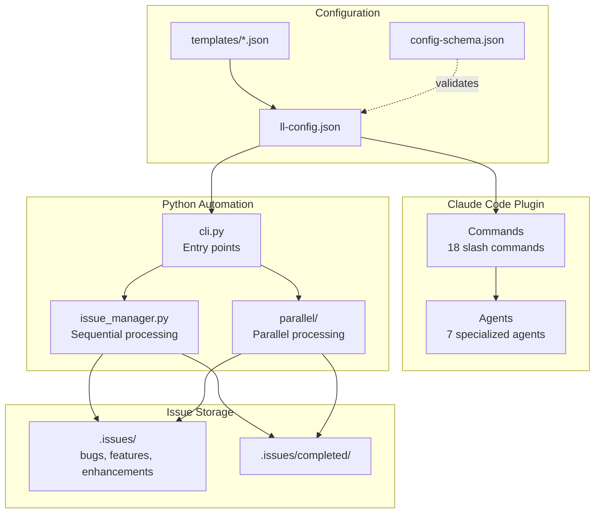
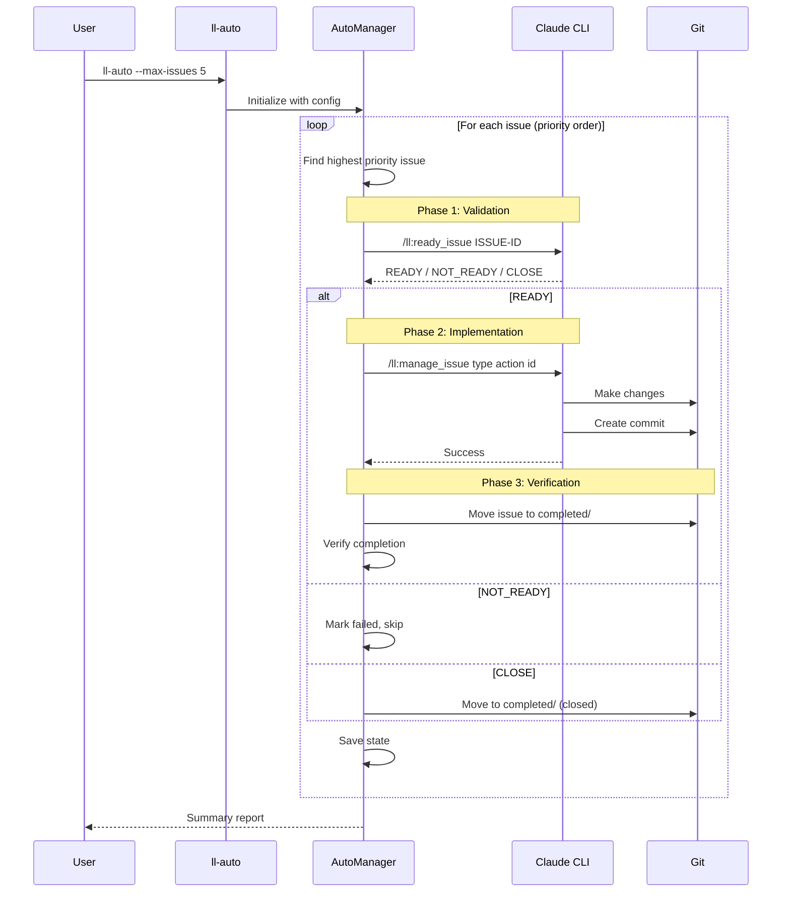
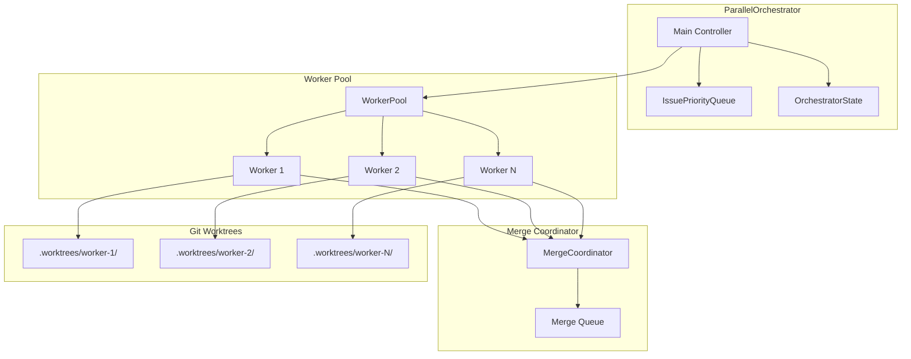
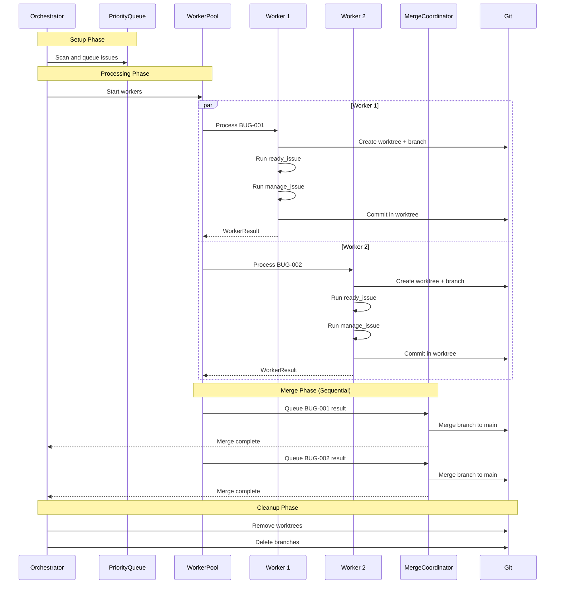
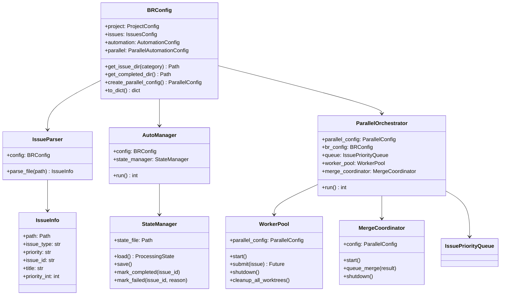
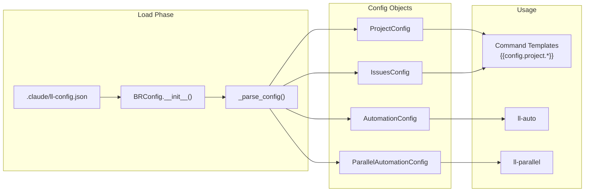
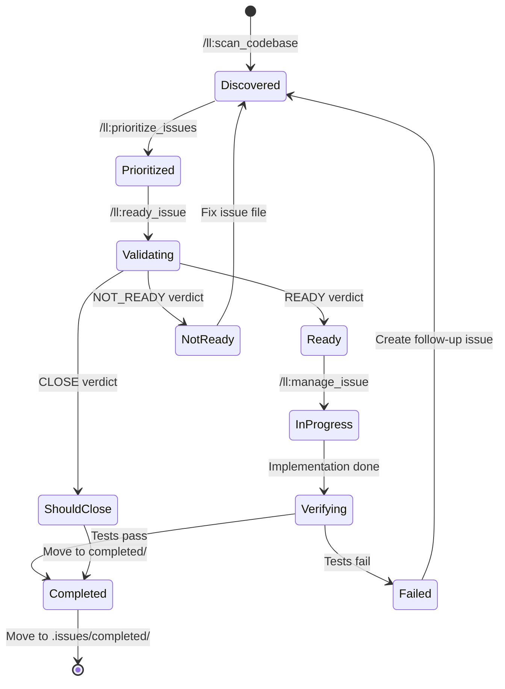
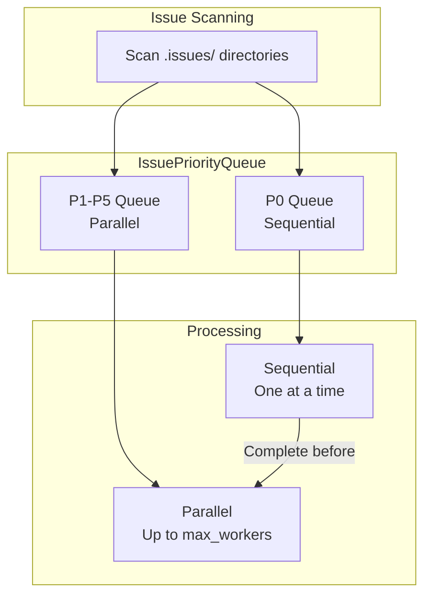
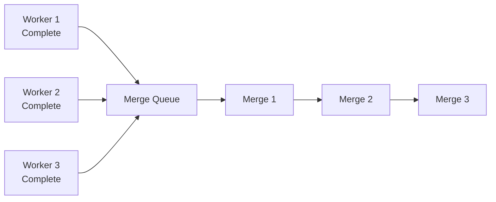
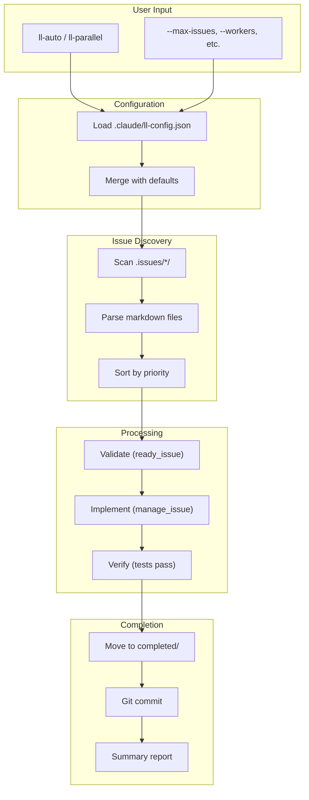

# Architecture Overview

little-loops is a Claude Code plugin providing development workflow automation with issue management, code quality commands, and parallel processing capabilities.

> **Related Documentation:**
> - [API Reference](API.md) - Detailed class and method documentation
> - [Troubleshooting](TROUBLESHOOTING.md) - Common issues and solutions
> - [README](../README.md) - Installation and quick start

## System Components

The system consists of three main layers:

1. **Command Layer** - Slash commands and agents for Claude Code
2. **Automation Layer** - Python CLI tools for batch processing
3. **Configuration Layer** - JSON-based project configuration

## High-Level Architecture



## Directory Structure

```
little-loops/
├── plugin.json              # Plugin manifest
├── config-schema.json       # JSON Schema for validation
├── commands/                # 18 slash command templates
│   ├── init.md
│   ├── help.md
│   ├── check_code.md
│   ├── run_tests.md
│   ├── manage_issue.md
│   ├── normalize_issues.md
│   └── ...
├── agents/                  # 7 specialized agents
│   ├── codebase-analyzer.md
│   ├── codebase-locator.md
│   ├── codebase-pattern-finder.md
│   ├── consistency-checker.md
│   ├── plugin-config-auditor.md
│   ├── prompt-optimizer.md
│   └── web-search-researcher.md
├── hooks/                   # Lifecycle hooks and validation scripts
│   ├── hooks.json           # Hook configuration
│   ├── check-duplicate-issue-id.sh  # Validation script
│   └── prompts/
│       ├── post-tool-state-tracking.md
│       ├── pre-compact-state.md
│       └── continuation-prompt-template.md
├── templates/               # Project type configs
│   ├── python-generic.json
│   ├── javascript.json
│   ├── typescript.json
│   ├── go.json
│   ├── rust.json
│   ├── java-maven.json
│   ├── java-gradle.json
│   ├── dotnet.json
│   └── generic.json
└── scripts/                 # Python package
    └── little_loops/
        ├── __init__.py
        ├── cli.py               # CLI entrypoints
        ├── config.py            # Configuration loading
        ├── state.py             # State persistence
        ├── logger.py            # Logging utilities
        ├── issue_manager.py     # Sequential automation
        ├── issue_parser.py      # Issue file parsing
        ├── issue_discovery.py   # Issue discovery and deduplication
        ├── issue_lifecycle.py   # Issue lifecycle operations
        ├── git_operations.py    # Git utilities
        ├── work_verification.py # Verification helpers
        ├── subprocess_utils.py  # Subprocess handling
        └── parallel/
            ├── __init__.py
            ├── orchestrator.py
            ├── worker_pool.py
            ├── merge_coordinator.py
            ├── priority_queue.py
            ├── output_parsing.py
            ├── git_lock.py
            ├── types.py
            └── tasks/
                ├── README.md
                ├── lint-all.yaml
                ├── test-suite.yaml
                ├── build-assets.yaml
                └── health-check.yaml
```

---

## Sequential Mode (ll-auto)

The sequential mode processes issues one at a time in priority order.



### Sequential Mode Components

| Component | File | Purpose |
|-----------|------|---------|
| `AutoManager` | `issue_manager.py` | Main orchestration loop |
| `IssueParser` | `issue_parser.py` | Parse issue files |
| `StateManager` | `state.py` | Persist state for resume |
| `Logger` | `logger.py` | Colorized console output |

---

## Parallel Mode (ll-parallel)

The parallel mode uses git worktrees to process multiple issues concurrently.



### Parallel Processing Flow



### Parallel Mode Components

| Component | File | Purpose |
|-----------|------|---------|
| `ParallelOrchestrator` | `orchestrator.py` | Coordinate all components |
| `IssuePriorityQueue` | `priority_queue.py` | Priority-based issue ordering |
| `WorkerPool` | `worker_pool.py` | Thread pool with worktrees |
| `MergeCoordinator` | `merge_coordinator.py` | Sequential merge queue |

---

## Class Relationships



---

## Configuration Flow



---

## Issue Processing Lifecycle



---

## Priority Queue Design

The priority queue separates P0 (critical) issues for sequential processing while allowing P1-P5 to be processed in parallel.



**Rationale**: P0 issues are critical and may have dependencies. Processing them sequentially ensures stability before parallel work begins.

---

## Key Design Decisions

### Git Worktree Isolation

Each parallel worker operates in a separate git worktree:

```
.worktrees/
├── worker-1/           # Full repo copy
│   ├── src/
│   ├── tests/
│   └── .claude/
├── worker-2/
└── worker-N/
```

**Benefits**:
- No file conflicts between workers
- Each worker has isolated branch
- Clean rollback on failure

**Trade-offs**:
- Disk space usage (full copy per worker)
- Initial setup time for worktrees

### Sequential Merging

Despite parallel issue processing, merges happen one at a time:



**Rationale**: Parallel merges would cause conflicts. Sequential merging with rebase-on-conflict ensures clean integration.

### State Persistence

Both modes save state for resume capability:

| Mode | State File | Contents |
|------|------------|----------|
| Sequential | `.auto-manage-state.json` | Current issue, completed list, failed list, timing |
| Parallel | `.parallel-manage-state.json` | In-progress, completed, failed, pending merges |

**Format**:
```json
{
  "completed_issues": ["BUG-001", "BUG-002"],
  "failed_issues": {"BUG-003": "Test failure"},
  "attempted_issues": ["BUG-001", "BUG-002", "BUG-003"],
  "timing": {
    "BUG-001": {"ready": 30.5, "implement": 120.2, "verify": 5.1}
  }
}
```

### Merge Strategy

The merge coordinator uses:
1. Fast-forward merge when possible
2. Rebase worker branch on conflict
3. Retry up to `max_merge_retries` times
4. Auto-stash local changes before merge

---

## Data Flow Summary


