# Architecture Overview

little-loops is a Claude Code plugin providing development workflow automation with issue management, code quality commands, and parallel processing capabilities.

> **Related Documentation:**
> - [Command Reference](COMMANDS.md) - All slash commands with usage
> - [API Reference](API.md) - Detailed class and method documentation
> - [Troubleshooting](TROUBLESHOOTING.md) - Common issues and solutions
> - [README](../README.md) - Installation and quick start

## System Components

The system consists of three main layers:

1. **Command Layer** - Slash commands and agents for Claude Code
2. **Automation Layer** - Python CLI tools for batch processing
3. **Configuration Layer** - JSON-based project configuration

## High-Level Architecture


## Directory Structure

```
little-loops/
├── .claude-plugin/
│   └── plugin.json          # Plugin manifest
├── config-schema.json       # JSON Schema for validation
├── commands/                # 34 slash command templates
│   ├── init.md
│   ├── help.md
│   ├── check_code.md
│   ├── run_tests.md
│   ├── manage_issue.md
│   ├── normalize_issues.md
│   └── ...
├── agents/                  # 8 specialized agents
│   ├── codebase-analyzer.md
│   ├── codebase-locator.md
│   ├── codebase-pattern-finder.md
│   ├── consistency-checker.md
│   ├── plugin-config-auditor.md
│   ├── prompt-optimizer.md
│   ├── web-search-researcher.md
│   └── workflow-pattern-analyzer.md
├── hooks/                   # Lifecycle hooks and validation scripts
│   ├── hooks.json           # Hook configuration
│   ├── prompts/
│   │   ├── continuation-prompt-template.md  # Handoff prompt template
│   │   └── optimize-prompt-hook.md          # Prompt optimization hook
│   └── scripts/             # Hook scripts
│       ├── check-duplicate-issue-id.sh
│       ├── context-monitor.sh
│       ├── precompact-state.sh
│       ├── session-cleanup.sh
│       ├── session-start.sh
│       ├── user-prompt-check.sh
│       └── lib/
│           └── common.sh    # Shared shell functions
├── loops/                   # Built-in FSM loop definitions
│   ├── codebase-scan.yaml
│   ├── issue-readiness-cycle.yaml
│   ├── issue-verification.yaml
│   ├── pre-pr-checks.yaml
│   └── quality-gate.yaml
├── skills/                  # 6 skill definitions
│   ├── analyze-history/
│   │   └── SKILL.md
│   ├── issue-size-review/
│   │   └── SKILL.md
│   ├── issue-workflow/
│   │   └── SKILL.md
│   ├── map-dependencies/
│   │   └── SKILL.md
│   ├── product-analyzer/
│   │   └── SKILL.md
│   └── workflow-automation-proposer/
│       └── SKILL.md
├── templates/               # Project type configs
│   ├── python-generic.json
│   ├── javascript.json
│   ├── typescript.json
│   ├── go.json
│   ├── rust.json
│   ├── java-maven.json
│   ├── java-gradle.json
│   ├── dotnet.json
│   └── generic.json
└── scripts/                 # Python package
    └── little_loops/
        ├── __init__.py
        ├── cli.py               # CLI entrypoints
        ├── cli_args.py          # Argument parsing
        ├── config.py            # Configuration loading
        ├── state.py             # State persistence
        ├── logger.py            # Logging utilities
        ├── logo.py              # CLI logo display
        ├── frontmatter.py       # YAML frontmatter parsing
        ├── doc_counts.py        # Documentation count utilities
        ├── link_checker.py      # Link validation
        ├── issue_manager.py     # Sequential automation
        ├── issue_parser.py      # Issue file parsing
        ├── issue_discovery.py   # Issue discovery and deduplication
        ├── issue_lifecycle.py   # Issue lifecycle operations
        ├── issue_history.py     # Issue history and statistics
        ├── git_operations.py    # Git utilities
        ├── work_verification.py # Verification helpers
        ├── subprocess_utils.py  # Subprocess handling
        ├── sprint.py            # Sprint definition and management
        ├── sync.py              # GitHub Issues sync
        ├── goals_parser.py      # Goals file parsing
        ├── dependency_graph.py  # Dependency graph construction
        ├── dependency_mapper.py # Cross-issue dependency discovery
        ├── user_messages.py     # User message extraction
        ├── workflow_sequence_analyzer.py  # Workflow analysis
        ├── fsm/                  # FSM loop execution engine
        │   ├── __init__.py
        │   ├── schema.py            # Loop schema definitions
        │   ├── fsm-loop-schema.json # JSON Schema for loop files
        │   ├── compilers.py         # YAML to FSM compilation
        │   ├── concurrency.py       # Concurrent loop execution
        │   ├── evaluators.py        # Condition evaluation
        │   ├── executor.py          # Loop execution
        │   ├── interpolation.py     # Variable interpolation
        │   ├── validation.py        # Schema validation
        │   ├── persistence.py       # State persistence
        │   ├── signal_detector.py   # Output signal detection
        │   └── handoff_handler.py   # Session handoff handling
        └── parallel/
            ├── __init__.py
            ├── orchestrator.py
            ├── worker_pool.py
            ├── merge_coordinator.py
            ├── priority_queue.py
            ├── output_parsing.py
            ├── git_lock.py
            ├── file_hints.py       # File hint extraction
            ├── overlap_detector.py  # File overlap detection
            ├── types.py
            └── tasks/
                ├── README.md
                ├── lint-all.yaml
                ├── test-suite.yaml
                ├── build-assets.yaml
                └── health-check.yaml
```

---

## Sequential Mode (ll-auto)

The sequential mode processes issues one at a time in priority order.

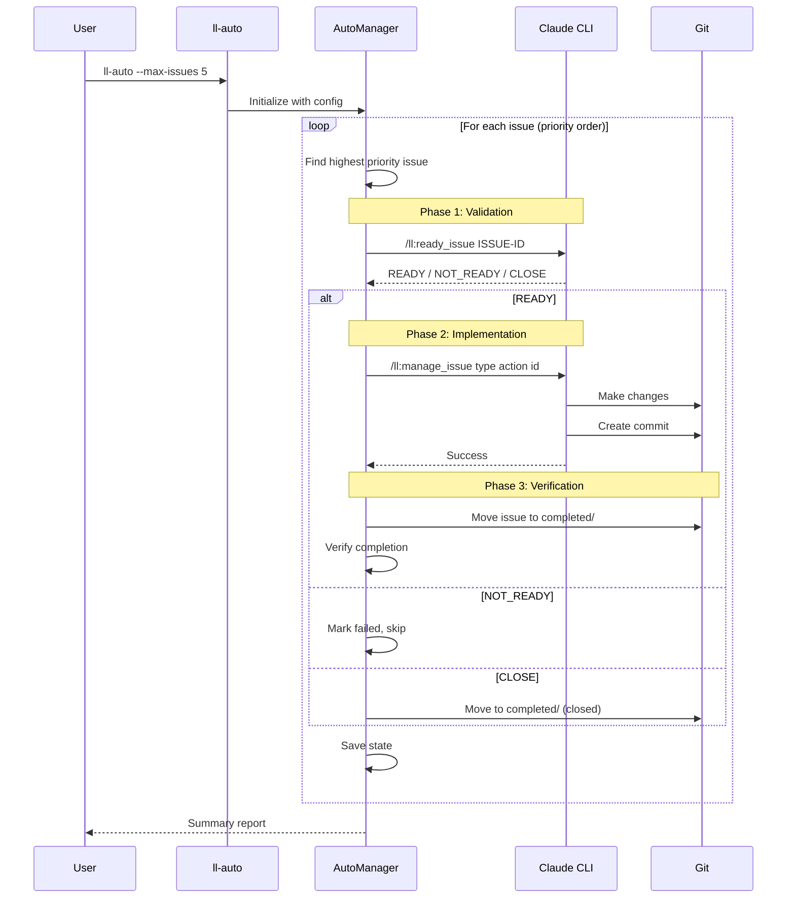

### Sequential Mode Components

| Component | File | Purpose |
|-----------|------|---------|
| `AutoManager` | `issue_manager.py` | Main orchestration loop |
| `IssueParser` | `issue_parser.py` | Parse issue files |
| `StateManager` | `state.py` | Persist state for resume |
| `Logger` | `logger.py` | Colorized console output |

---

## Parallel Mode (ll-parallel)

The parallel mode uses git worktrees to process multiple issues concurrently.

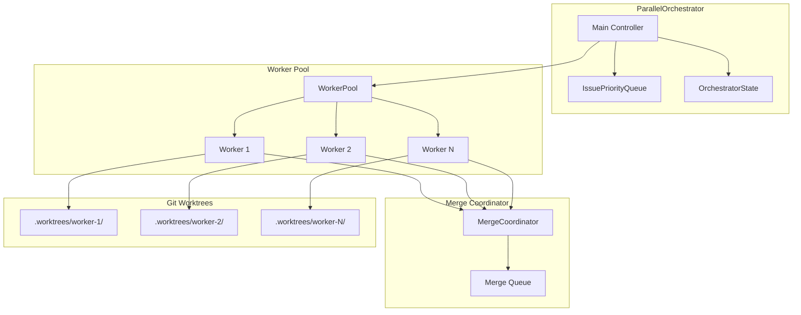

### Parallel Processing Flow

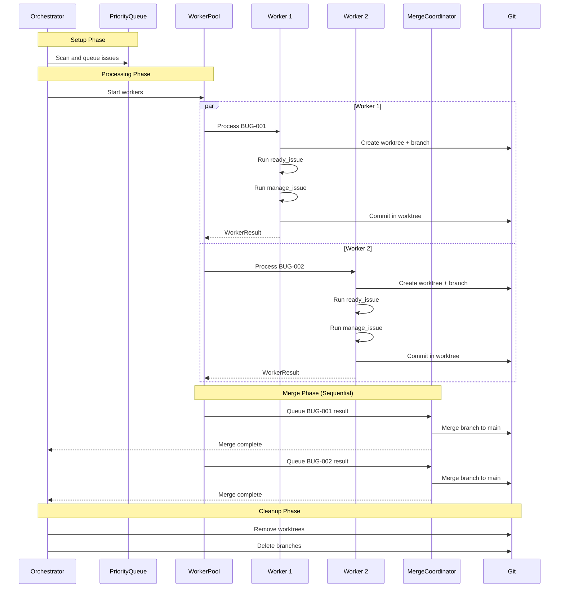

### Parallel Mode Components

| Component | File | Purpose |
|-----------|------|---------|
| `ParallelOrchestrator` | `orchestrator.py` | Coordinate all components |
| `IssuePriorityQueue` | `priority_queue.py` | Priority-based issue ordering |
| `WorkerPool` | `worker_pool.py` | Thread pool with worktrees |
| `MergeCoordinator` | `merge_coordinator.py` | Sequential merge queue |

---

## Class Relationships

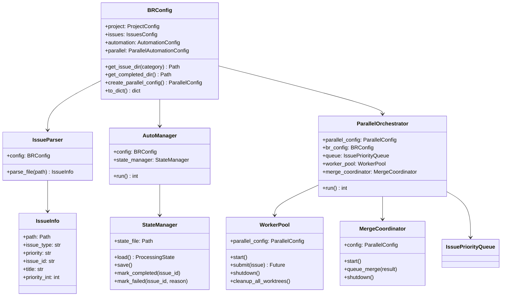

---

## Configuration Flow

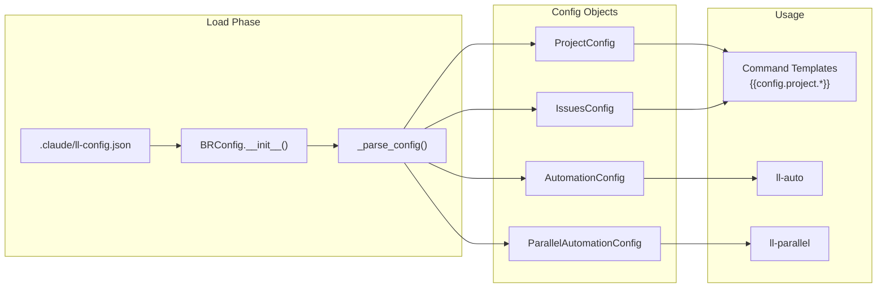

---

## Issue Processing Lifecycle

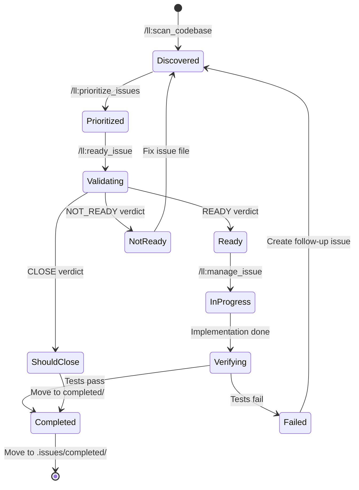

---

## Priority Queue Design

The priority queue separates P0 (critical) issues for sequential processing while allowing P1-P5 to be processed in parallel.

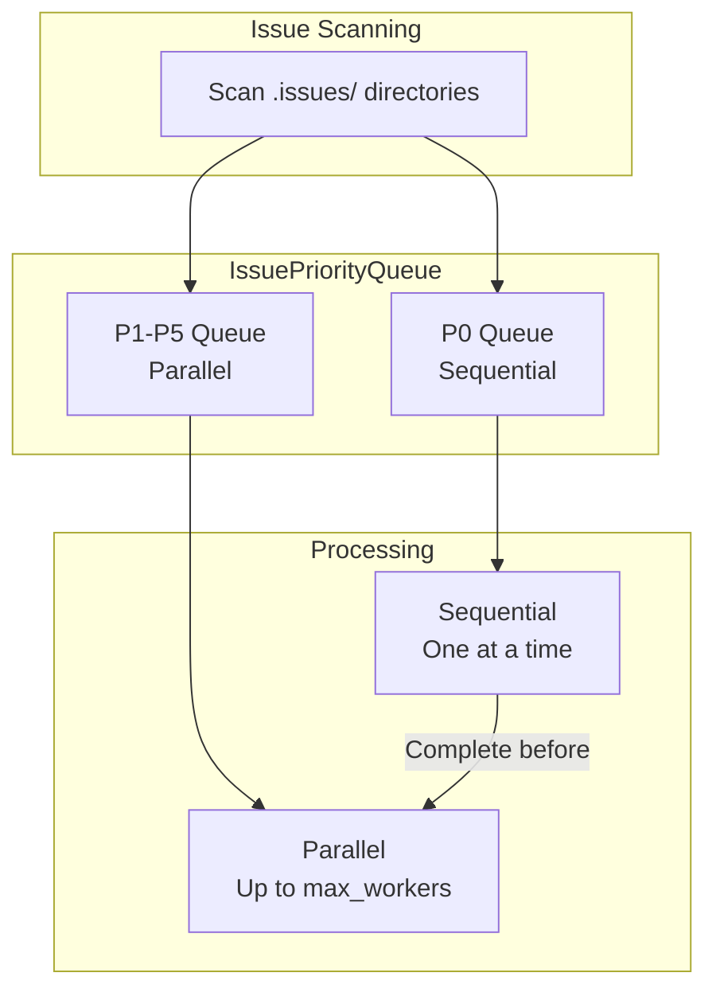

**Rationale**: P0 issues are critical and may have dependencies. Processing them sequentially ensures stability before parallel work begins.

---

## Sprint Mode (ll-sprint)

Sprint execution uses dependency-aware wave-based scheduling. Issues are grouped into waves where each wave contains issues whose blockers have all completed.

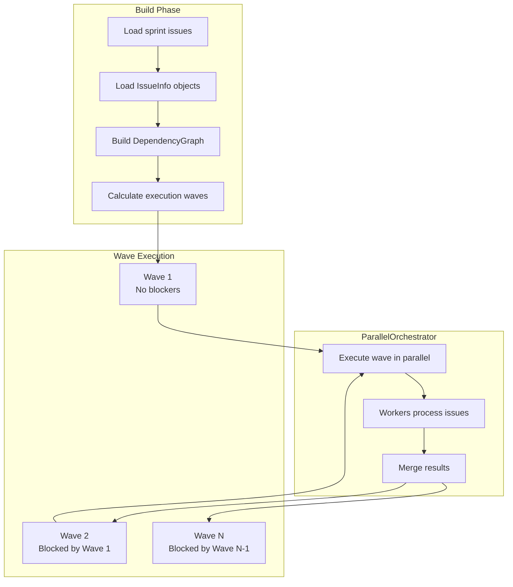

### Sprint Execution Flow

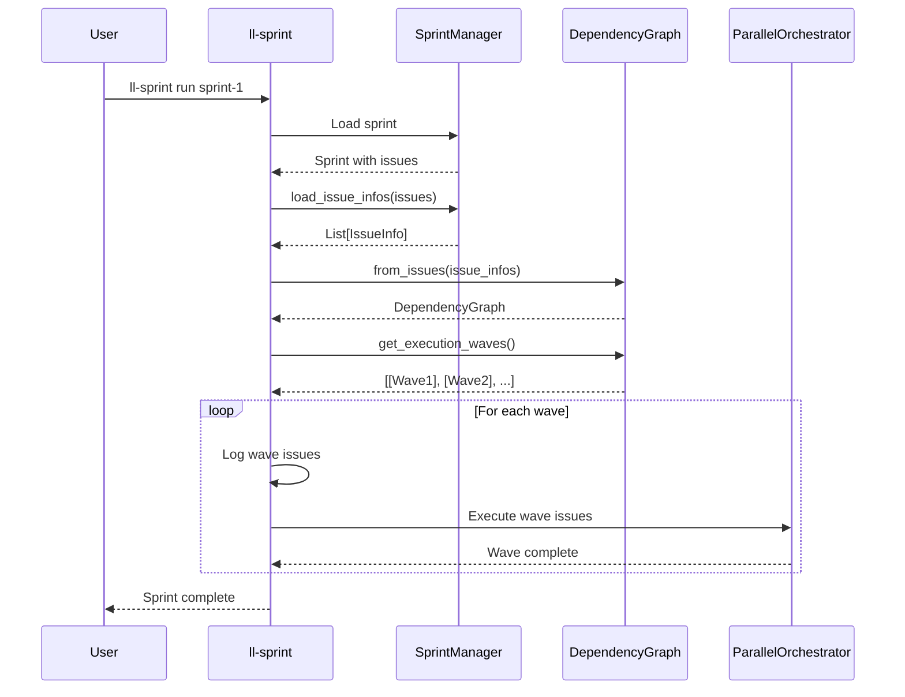

### Wave Calculation Example

Given issues with dependencies:
- `FEAT-001`: No blockers
- `BUG-001`: No blockers
- `FEAT-002`: Blocked by FEAT-001
- `FEAT-003`: Blocked by FEAT-001
- `FEAT-004`: Blocked by FEAT-002, FEAT-003

The `DependencyGraph.get_execution_waves()` returns:

| Wave | Issues | Reason |
|------|--------|--------|
| 1 | FEAT-001, BUG-001 | No blockers |
| 2 | FEAT-002, FEAT-003 | FEAT-001 completed in Wave 1 |
| 3 | FEAT-004 | FEAT-002, FEAT-003 completed in Wave 2 |

Issues within each wave execute in parallel. Waves execute sequentially.

### Dependency Discovery

The `dependency_mapper` module complements `dependency_graph` by discovering new dependency relationships:

- **dependency_graph.py**: Execution ordering from existing `Blocked By` data
- **dependency_mapper.py**: Discovery of new relationships via file overlap + semantic conflict analysis

The `/ll:map_dependencies` skill uses `dependency_mapper` to analyze active issues, propose dependencies based on shared file references, validate existing dependency integrity (broken refs, missing backlinks, cycles), and write approved relationships to issue files.

#### Semantic Conflict Analysis

When two issues reference the same file, the mapper goes beyond simple file overlap to determine whether they actually conflict. It computes a **conflict score** (0.0–1.0) from three signals:

1. **Semantic target overlap** (weight 0.5) — Extracts PascalCase component names, function references, and explicit scope mentions from issue content, then computes Jaccard similarity
2. **Section mention overlap** (weight 0.3) — Detects UI region keywords (header, body, sidebar, footer, card, modal, form) and checks if both issues target the same region
3. **Modification type match** (weight 0.2) — Classifies each issue as structural, infrastructure, or enhancement based on keyword matching

**Score thresholds:**
- **< 0.4**: Parallel-safe — issues touch different sections of the same file and can run concurrently
- **>= 0.4**: Dependency proposed — issues likely conflict and should be sequenced

**Same-priority ordering**: When two conflicting issues share the same priority, the mapper uses modification type to determine direction (structural → infrastructure → enhancement) rather than arbitrary ID ordering.

---

## Key Design Decisions

### Git Worktree Isolation

Each parallel worker operates in a separate git worktree:

```
.worktrees/
├── worker-1/           # Full repo copy
│   ├── src/
│   ├── tests/
│   └── .claude/
├── worker-2/
└── worker-N/
```

**Benefits**:
- No file conflicts between workers
- Each worker has isolated branch
- Clean rollback on failure

**Trade-offs**:
- Disk space usage (full copy per worker)
- Initial setup time for worktrees

### Sequential Merging

Despite parallel issue processing, merges happen one at a time:

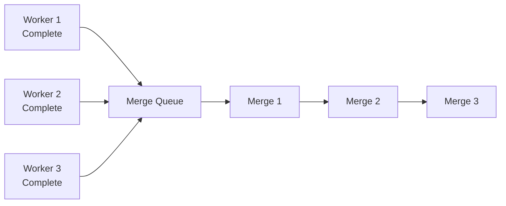

**Rationale**: Parallel merges would cause conflicts. Sequential merging with rebase-on-conflict ensures clean integration.

### State Persistence

Both modes save state for resume capability:

| Mode | State File | Contents |
|------|------------|----------|
| Sequential | `.auto-manage-state.json` | Current issue, completed list, failed list, timing |
| Parallel | `.parallel-manage-state.json` | In-progress, completed, failed, pending merges |

**Format**:
```json
{
  "completed_issues": ["BUG-001", "BUG-002"],
  "failed_issues": {"BUG-003": "Test failure"},
  "attempted_issues": ["BUG-001", "BUG-002", "BUG-003"],
  "timing": {
    "BUG-001": {"ready": 30.5, "implement": 120.2, "verify": 5.1}
  }
}
```

### Merge Strategy

The merge coordinator is a sophisticated git operations state machine that handles:
1. Sequential merge queue (one at a time to avoid conflicts)
2. Automatic stash/unstash of local changes with smart exclusions
3. Adaptive pull strategy (tracks problematic commits, switches to merge on repeat)
4. Index recovery (detects and repairs corrupted git state)
5. Lifecycle file coordination (auto-commits pending moves)
6. Conflict retry with rebase (up to `max_merge_retries` times)
7. Circuit breaker (pauses after consecutive failures)
8. Untracked file backup and retry

**See [MERGE-COORDINATOR.md](MERGE-COORDINATOR.md) for comprehensive documentation.**

### Context Monitor and Session Continuation

When context window limits approach, the system can automatically preserve work and spawn fresh sessions.

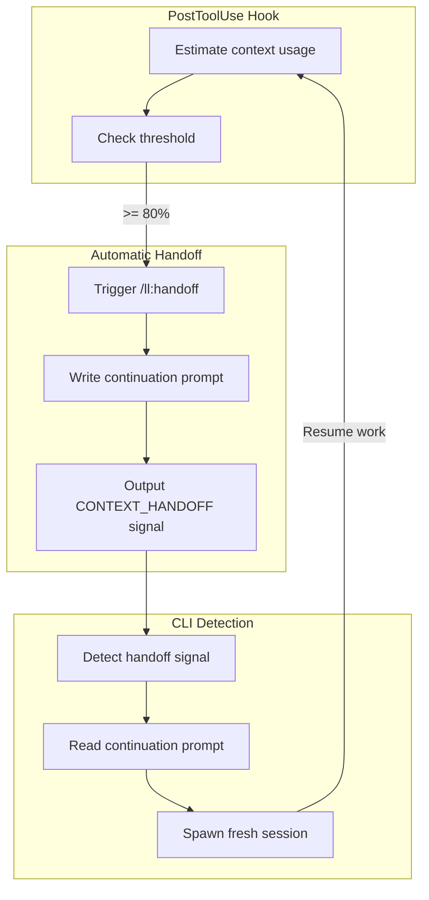

**Context Estimation**: The hook estimates tokens based on tool usage:

| Tool | Estimation |
|------|------------|
| Read | `lines × 10 tokens` |
| Grep | `output_lines × 5 tokens` |
| Bash | `chars × 0.3 tokens` |
| Task | `2000 tokens` (summarized) |
| WebFetch | `1500 tokens` |
| Other | `100 tokens` base |

**Continuation Flow**:

1. **Hook triggers** at 80% estimated context usage (configurable)
2. **Handoff command** generates `.claude/ll-continue-prompt.md` with session state
3. **CLI tools** (`ll-auto`, `ll-parallel`) detect `CONTEXT_HANDOFF` signal in output
4. **Fresh session** spawned with continuation prompt
5. **Work continues** seamlessly from saved state

**Configuration** (disabled by default):
```json
{
  "context_monitor": {
    "enabled": true,
    "auto_handoff_threshold": 80,
    "context_limit_estimate": 150000
  }
}
```

**Files**:
- `hooks/prompts/continuation-prompt-template.md` - Template for handoff prompts
- `.claude/ll-context-state.json` - Running context usage state
- `.claude/ll-continue-prompt.md` - Generated continuation prompt
- `subprocess_utils.py` - Handoff detection and continuation reading

---

## Data Flow Summary

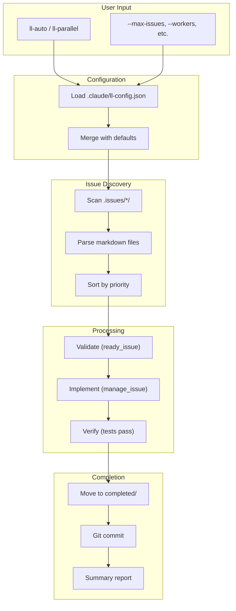