# Architecture Overview

little-loops is a Claude Code plugin providing development workflow automation with issue management, code quality commands, and parallel processing capabilities.

> **Related Documentation:**
> - [Command Reference](reference/COMMANDS.md) - All slash commands with usage
> - [API Reference](reference/API.md) - Detailed class and method documentation
> - [Troubleshooting](development/TROUBLESHOOTING.md) - Common issues and solutions
> - [README](../README.md) - Installation and quick start

## System Components

The system consists of three main layers:

1. **Command Layer** - Slash commands, skills, and agents for Claude Code
2. **Automation Layer** - Python CLI tools for batch processing
3. **Configuration Layer** - JSON-based project configuration

## High-Level Architecture

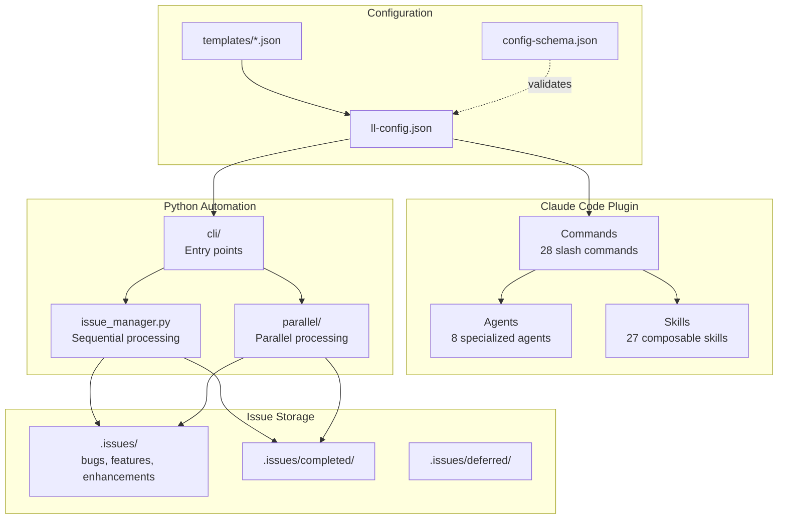
```mermaid
flowchart TB
    subgraph "Claude Code Plugin"
        CMD[Commands<br/>28 slash commands]
        AGT[Agents<br/>8 specialized agents]
        SKL[Skills<br/>27 composable skills]
    end

    subgraph "Configuration"
        CFG[ll-config.json]
        SCHEMA[config-schema.json]
        TPL[templates/*.json]
    end

    subgraph "Python Automation"
        CLI[cli/<br/>Entry points]
        AUTO[issue_manager.py<br/>Sequential processing]
        PARALLEL[parallel/<br/>Parallel processing]
    end

    subgraph "Issue Storage"
        ISSUES[.issues/<br/>bugs, features, enhancements]
        COMPLETED[.issues/completed/]
        DEFERRED[.issues/deferred/]
    end

    CFG --> CMD
    TPL --> CFG
    SCHEMA -.->|validates| CFG
    CFG --> CLI
    CMD --> AGT
    CMD --> SKL
    CLI --> AUTO
    CLI --> PARALLEL
    AUTO --> ISSUES
    PARALLEL --> ISSUES
    AUTO --> COMPLETED
    PARALLEL --> COMPLETED
```

## Directory Structure

```
little-loops/
├── .claude-plugin/
│   └── plugin.json          # Plugin manifest
├── config-schema.json       # JSON Schema for validation
├── commands/                # 28 slash command templates
│   ├── help.md
│   ├── check-code.md
│   ├── run-tests.md
│   ├── scan-codebase.md
│   ├── normalize-issues.md
│   └── ...
├── agents/                  # 8 specialized agents
│   ├── codebase-analyzer.md
│   ├── codebase-locator.md
│   ├── codebase-pattern-finder.md
│   ├── consistency-checker.md
│   ├── plugin-config-auditor.md
│   ├── prompt-optimizer.md
│   ├── web-search-researcher.md
│   └── workflow-pattern-analyzer.md
├── hooks/                   # Lifecycle hooks and validation scripts
│   ├── hooks.json           # Hook configuration
│   ├── prompts/
│   │   ├── continuation-prompt-template.md  # Handoff prompt template
│   │   └── optimize-prompt-hook.md          # Prompt optimization hook
│   └── scripts/             # Hook scripts
│       ├── check-duplicate-issue-id.sh
│       ├── context-monitor.sh
│       ├── precompact-state.sh
│       ├── scratch-pad-redirect.sh
│       ├── session-cleanup.sh
│       ├── session-start.sh
│       ├── user-prompt-check.sh
│       └── lib/
│           └── common.sh    # Shared shell functions
├── loops/                   # Built-in FSM loop definitions (YAML); composable as sub-loops
├── skills/                  # 27 skill definitions
│   ├── analyze-history/     # Proactive
│   │   └── SKILL.md
│   ├── analyze-loop/        # User-invoked
│   │   └── SKILL.md
│   ├── audit-claude-config/ # User-invoked
│   │   ├── SKILL.md
│   │   └── report-template.md
│   ├── audit-docs/          # User-invoked
│   │   ├── SKILL.md
│   │   └── templates.md
│   ├── audit-issue-conflicts/ # User-invoked
│   │   └── SKILL.md
│   ├── capture-issue/       # Proactive
│   │   ├── SKILL.md
│   │   └── templates.md
│   ├── cleanup-loops/       # User-invoked
│   │   └── SKILL.md
│   ├── confidence-check/    # Proactive
│   │   └── SKILL.md
│   ├── configure/           # User-invoked
│   │   ├── SKILL.md
│   │   ├── areas.md
│   │   └── show-output.md
│   ├── create-eval-from-issues/ # User-invoked
│   │   └── SKILL.md
│   ├── create-loop/         # User-invoked
│   │   ├── SKILL.md
│   │   ├── loop-types.md
│   │   ├── reference.md
│   │   └── templates.md
│   ├── format-issue/        # User-invoked
│   │   ├── SKILL.md
│   │   └── templates.md
│   ├── go-no-go/            # User-invoked
│   │   └── SKILL.md
│   ├── improve-claude-md/   # User-invoked
│   │   ├── SKILL.md
│   │   └── algorithm.md
│   ├── init/                # User-invoked
│   │   ├── SKILL.md
│   │   └── interactive.md
│   ├── issue-size-review/   # Proactive
│   │   └── SKILL.md
│   ├── issue-workflow/      # User-invoked
│   │   └── SKILL.md
│   ├── manage-issue/        # User-invoked
│   │   ├── SKILL.md
│   │   └── templates.md
│   ├── map-dependencies/    # Proactive
│   │   └── SKILL.md
│   ├── product-analyzer/    # User-invoked
│   │   └── SKILL.md
│   ├── review-loop/         # User-invoked
│   │   └── SKILL.md
│   ├── update/              # User-invoked
│   │   └── SKILL.md
│   ├── update-docs/         # User-invoked
│   │   └── SKILL.md
│   └── workflow-automation-proposer/  # User-invoked
│       └── SKILL.md
├── templates/               # Project type configs
│   ├── python-generic.json
│   ├── javascript.json
│   ├── typescript.json
│   ├── go.json
│   ├── rust.json
│   ├── java-maven.json
│   ├── java-gradle.json
│   ├── dotnet.json
│   ├── bug-sections.json
│   ├── feat-sections.json
│   ├── enh-sections.json
│   ├── ll-goals-template.md
│   ├── extension/           # Extension scaffold templates (.tmpl)
│   └── generic.json
└── scripts/                 # Python package
    └── little_loops/
        ├── __init__.py
        ├── cli/                 # CLI entrypoints (package)
        │   ├── __init__.py
        │   ├── auto.py
        │   ├── create_extension.py  # ll-create-extension scaffold CLI
        │   ├── parallel.py
        │   ├── messages.py
        │   ├── sync.py
        │   ├── docs.py
        │   ├── history.py
        │   ├── deps.py              # ll-deps entry point
        │   ├── output.py            # Shared CLI output utilities (colors, terminal width)
        │   ├── sprint/
        │   │   ├── __init__.py      # Entry point (main_sprint) + argparse
        │   │   ├── _helpers.py      # Shared utilities
        │   │   ├── create.py        # create subcommand
        │   │   ├── edit.py          # edit subcommand
        │   │   ├── manage.py        # delete, analyze subcommands
        │   │   ├── run.py           # run subcommand
        │   │   └── show.py          # list, show subcommands
        │   ├── issues/
        │   │   ├── __init__.py      # Entry point (main_issues) + argparse
        │   │   ├── list_cmd.py      # list subcommand
        │   │   ├── next_id.py       # next-id subcommand
        │   │   ├── count_cmd.py     # count subcommand
        │   │   ├── search.py        # search subcommand
        │   │   ├── sequence.py      # sequence subcommand
        │   │   ├── impact_effort.py # impact-effort subcommand
        │   │   ├── show.py          # show subcommand
        │   │   ├── refine_status.py # refine-status subcommand
        │   │   ├── append_log.py    # append-log subcommand
        │   │   └── anchor_sweep.py  # anchor-sweep subcommand (CLI wrapper)
        │   ├── loop/
        │   │   ├── __init__.py      # Entry point (main_loop) + argparse
        │   │   ├── _helpers.py      # Shared utilities
        │   │   ├── run.py           # run subcommand
        │   │   ├── config_cmds.py   # compile, validate, install
        │   │   ├── lifecycle.py     # status, stop, resume
        │   │   ├── info.py          # list, history, show
        │   │   └── testing.py       # ll-loop test/simulate subcommand utilities
        │   └── logs.py              # ll-logs: discover/extract/tail subcommands + index generation
        ├── cli_args.py          # Argument parsing
        ├── config.py            # Configuration loading
        ├── state.py             # State persistence
        ├── logger.py            # Logging utilities
        ├── logo.py              # CLI logo display
        ├── frontmatter.py       # YAML frontmatter parsing
        ├── learning_tests.py    # Learning test registry (CRUD for .ll/learning-tests/)
        ├── doc_counts.py        # Documentation count utilities
        ├── link_checker.py      # Link validation
        ├── issue_manager.py     # Sequential automation
        ├── issue_parser.py      # Issue file parsing
        ├── issue_discovery/     # Issue discovery and deduplication (package)
        │   ├── __init__.py      # Re-exports public API
        │   ├── matching.py      # Types and text similarity helpers
        │   ├── extraction.py    # Git history analysis and regression detection
        │   └── search.py        # Issue file search and discovery functions
        ├── issue_lifecycle.py   # Issue lifecycle operations
        ├── issue_history/       # Issue history and statistics (package)
        ├── git_operations.py    # Git utilities
        ├── work_verification.py # Verification helpers
        ├── text_utils.py        # Text processing utilities
        ├── subprocess_utils.py  # Subprocess handling
        ├── sprint.py            # Sprint definition and management
        ├── sync.py              # GitHub Issues sync
        ├── goals_parser.py      # Goals file parsing
        ├── dependency_graph.py  # Dependency graph construction
        ├── dependency_mapper/   # Cross-issue dependency discovery (sub-package)
        │   ├── __init__.py      #   Re-exports for backwards compatibility
        │   ├── models.py        #   Data models (DependencyProposal, FixResult, etc.)
        │   ├── analysis.py      #   Conflict scoring and dependency analysis
        │   ├── formatting.py    #   Report and graph formatting
        │   └── operations.py    #   File mutation operations (apply/fix)
        ├── issues/              # Issue utility sub-package (ENH-1300)
        │   ├── __init__.py      #   Package init
        │   ├── anchors.py       #   resolve_anchor(): language-agnostic backwards scan
        │   └── anchor_sweep.py  #   sweep_issues(): two-phase scan-and-rewrite
        ├── session_log.py       # Session log linking for issues
        ├── file_utils.py        # Shared file I/O utilities (atomic writes)
        ├── user_messages.py     # User message extraction
        ├── workflow_sequence/   # Workflow analysis (ll-workflows, sub-package)
        │   ├── __init__.py      #   Re-exports: analyze_workflows, models
        │   ├── analysis.py      #   Core analysis: boundaries, entity clustering
        │   ├── models.py        #   Data models (Workflow, SessionLink, etc.)
        │   └── io.py            #   YAML/JSON input-output helpers
        ├── fsm/                  # FSM loop execution engine
        │   ├── __init__.py
        │   ├── schema.py            # Loop schema definitions
        │   ├── fsm-loop-schema.json # JSON Schema for loop files
        │   ├── compilers.py         # YAML to FSM compilation
        │   ├── concurrency.py       # Concurrent loop execution
        │   ├── evaluators.py        # Condition evaluation
        │   ├── executor.py          # Loop execution
        │   ├── interpolation.py     # Variable interpolation
        │   ├── validation.py        # Schema validation
        │   ├── persistence.py       # State persistence
        │   ├── signal_detector.py   # Output signal detection
        │   ├── handoff_handler.py   # Session handoff handling
        │   └── rate_limit_circuit.py # Shared cross-worktree 429 circuit breaker
        ├── extension.py             # Extension protocol, loader, and reference implementation
        ├── testing.py               # Offline LLTestBus test harness for extension development
        ├── output_parsing.py        # Shared output parsing (ll-auto, ll-parallel)
        └── parallel/
            ├── __init__.py
            ├── orchestrator.py
            ├── worker_pool.py
            ├── merge_coordinator.py
            ├── priority_queue.py
            ├── git_lock.py
            ├── file_hints.py       # File hint extraction
            ├── overlap_detector.py  # File overlap detection
            ├── types.py
            └── tasks/
                ├── README.md
                ├── lint-all.yaml
                ├── test-suite.yaml
                ├── build-assets.yaml
                └── health-check.yaml
```

---

## Sequential Mode (ll-auto)

The sequential mode processes issues one at a time in priority order.

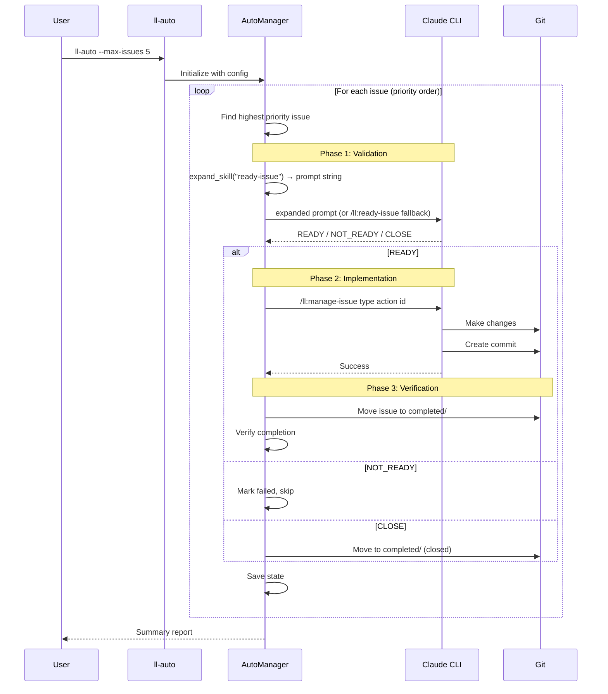
```mermaid
sequenceDiagram
    participant User
    participant CLI as ll-auto
    participant Manager as AutoManager
    participant Claude as Claude CLI
    participant Git

    User->>CLI: ll-auto --max-issues 5
    CLI->>Manager: Initialize with config

    loop For each issue (priority order)
        Manager->>Manager: Find highest priority issue

        Note over Manager,Claude: Phase 1: Validation
        Manager->>Manager: expand_skill("ready-issue") → prompt string
        Manager->>Claude: expanded prompt (or /ll:ready-issue fallback)
        Claude-->>Manager: READY / NOT_READY / CLOSE

        alt READY
            Note over Manager,Claude: Phase 2: Implementation
            Manager->>Claude: /ll:manage-issue type action id
            Claude->>Git: Make changes
            Claude->>Git: Create commit
            Claude-->>Manager: Success

            Note over Manager,Git: Phase 3: Verification
            Manager->>Git: Move issue to completed/
            Manager->>Manager: Verify completion
        else NOT_READY
            Manager->>Manager: Mark failed, skip
        else CLOSE
            Manager->>Git: Move to completed/ (closed)
        end

        Manager->>Manager: Save state
    end

    Manager-->>User: Summary report
```

### Sequential Mode Components

| Component | File | Purpose |
|-----------|------|---------|
| `AutoManager` | `issue_manager.py` | Main orchestration loop |
| `IssueParser` | `issue_parser.py` | Parse issue files |
| `StateManager` | `state.py` | Persist state for resume |
| `Logger` | `logger.py` | Colorized console output |

---

## Parallel Mode (ll-parallel)

The parallel mode uses git worktrees to process multiple issues concurrently.

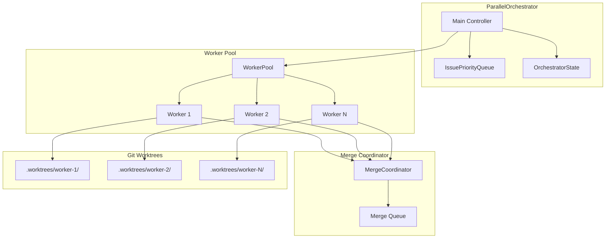
```mermaid
flowchart TB
    subgraph Orchestrator["ParallelOrchestrator"]
        ORCH[Main Controller]
        QUEUE[IssuePriorityQueue]
        STATE[OrchestratorState]
    end

    subgraph Workers["Worker Pool"]
        POOL[WorkerPool]
        W1[Worker 1]
        W2[Worker 2]
        WN[Worker N]
    end

    subgraph Merge["Merge Coordinator"]
        MCOORD[MergeCoordinator]
        MQUEUE[Merge Queue]
    end

    subgraph Worktrees["Git Worktrees"]
        WT1[".worktrees/worker-1/"]
        WT2[".worktrees/worker-2/"]
        WTN[".worktrees/worker-N/"]
    end

    ORCH --> QUEUE
    ORCH --> STATE
    ORCH --> POOL

    POOL --> W1
    POOL --> W2
    POOL --> WN

    W1 --> WT1
    W2 --> WT2
    WN --> WTN

    W1 --> MCOORD
    W2 --> MCOORD
    WN --> MCOORD

    MCOORD --> MQUEUE
```

### Parallel Processing Flow

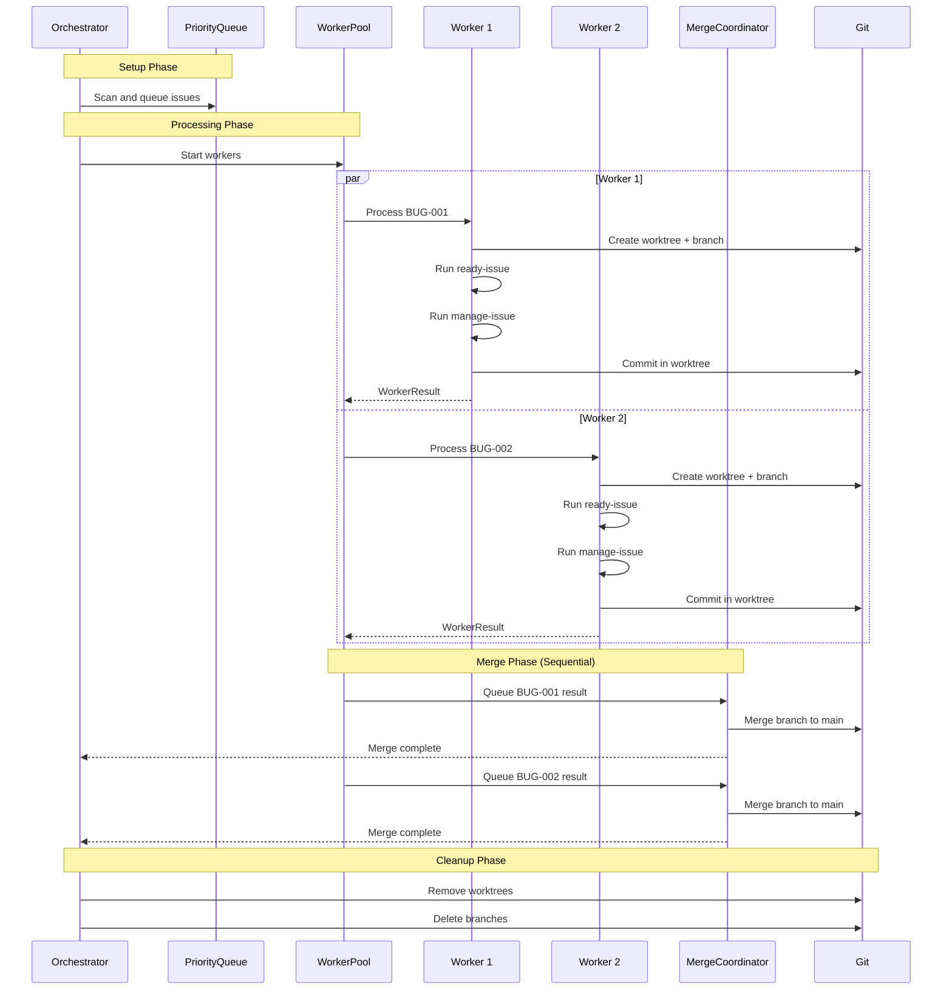
```mermaid
sequenceDiagram
    participant Orch as Orchestrator
    participant Queue as PriorityQueue
    participant Pool as WorkerPool
    participant W1 as Worker 1
    participant W2 as Worker 2
    participant Merge as MergeCoordinator
    participant Git

    Note over Orch,Queue: Setup Phase
    Orch->>Queue: Scan and queue issues

    Note over Orch,Pool: Processing Phase
    Orch->>Pool: Start workers

    par Worker 1
        Pool->>W1: Process BUG-001
        W1->>Git: Create worktree + branch
        W1->>W1: Run ready-issue
        W1->>W1: Run manage-issue
        W1->>Git: Commit in worktree
        W1-->>Pool: WorkerResult
    and Worker 2
        Pool->>W2: Process BUG-002
        W2->>Git: Create worktree + branch
        W2->>W2: Run ready-issue
        W2->>W2: Run manage-issue
        W2->>Git: Commit in worktree
        W2-->>Pool: WorkerResult
    end

    Note over Pool,Merge: Merge Phase (Sequential)
    Pool->>Merge: Queue BUG-001 result
    Merge->>Git: Merge branch to main
    Merge-->>Orch: Merge complete

    Pool->>Merge: Queue BUG-002 result
    Merge->>Git: Merge branch to main
    Merge-->>Orch: Merge complete

    Note over Orch,Git: Cleanup Phase
    Orch->>Git: Remove worktrees
    Orch->>Git: Delete branches
```

### Parallel Mode Components

| Component | File | Purpose |
|-----------|------|---------|
| `ParallelOrchestrator` | `orchestrator.py` | Coordinate all components |
| `IssuePriorityQueue` | `priority_queue.py` | Priority-based issue ordering |
| `WorkerPool` | `worker_pool.py` | Thread pool with worktrees |
| `MergeCoordinator` | `merge_coordinator.py` | Sequential merge queue |

---

## Extension Architecture & Event Flow

little-loops includes an extension architecture built on a structured event bus. Extensions implement the `LLExtension` protocol and receive `LLEvent` notifications from core subsystems. Topic-based filtering lets extensions subscribe only to the event namespaces they care about.

### Components

| Component | File | Purpose |
|-----------|------|---------|
| `LLEvent` | `events.py` | Structured event dataclass (type, timestamp, payload) |
| `EventBus` | `events.py` | Multi-observer dispatcher with optional JSONL file sink |
| `LLExtension` | `extension.py` | Runtime-checkable protocol for event consumers |
| `ExtensionLoader` | `extension.py` | Discovers extensions from config paths and entry points |
| `InterceptorExtension` | `extension.py` | Protocol for plugins providing `before_route`/`after_route` hooks; stored in `FSMExecutor._interceptors` |
| `ActionProviderExtension` | `extension.py` | Protocol for plugins providing custom `ActionRunner` instances; populated into `FSMExecutor._contributed_actions` |
| `EvaluatorProviderExtension` | `extension.py` | Protocol for plugins providing custom evaluator callables; populated into `FSMExecutor._contributed_evaluators` |
| `ReferenceInterceptorExtension` | `extensions/reference_interceptor.py` | Passthrough reference implementation of `InterceptorExtension`; copy-paste starting point for custom interceptors |

### Event Emitters

The `EventBus` is wired into the following subsystems, which emit events at key lifecycle points:

| Subsystem | File | Events Emitted |
|-----------|------|----------------|
| FSM Executor | `fsm/executor.py` | `fsm.state_enter`, `fsm.loop_complete`, `fsm.evaluate`, `fsm.route` |
| StateManager | `state.py` | State persistence events (save, load, mark completed/failed) |
| Issue Lifecycle | `issue_lifecycle.py` | Issue status transitions (move, close, defer) |
| Parallel Orchestrator | `parallel/orchestrator.py` | Worker start/complete, merge events |

Extensions are wired to the EventBus at CLI entry points via `wire_extensions()`, so they receive events from all subsystems during a run:

| CLI Entry Point | File | Extensions Wired |
|-----------------|------|-----------------|
| `ll-loop` | `cli/loop/run.py`, `cli/loop/lifecycle.py` | Yes — EventBus + FSMExecutor registry wired (interceptors, contributed actions/evaluators populated) |
| `ll-parallel` | `cli/parallel.py` | Yes — EventBus only (no FSMExecutor wiring) |
| `ll-sprint` | `cli/sprint/run.py` | Yes — EventBus only (no FSMExecutor wiring for parallel branch) |

### Extension Loading

Extensions are loaded via two mechanisms:
1. **Config paths**: `"extensions": ["my_package:MyExtension"]` in `ll-config.json`
2. **Entry points**: `importlib.metadata` discovery under the `little_loops.extensions` group

### Topic-Based Event Filtering

Extensions can declare an `event_filter` class attribute to subscribe only to specific event namespaces, using fnmatch glob patterns matched against the event's `"event"` key:

```python
class MyExtension:
    event_filter = "fsm.*"          # only FSM lifecycle events
    # event_filter = ["fsm.*", "issue.*"]  # multiple namespaces
    # event_filter = None           # all events (default)

    def on_event(self, event: LLEvent) -> None:
        ...
```

`wire_extensions()` forwards `event_filter` to `bus.register()`. If the attribute is absent or `None`, the extension receives all events.

See [API Reference — Extension API](reference/API.md#extension-api) for full protocol, loader, and `wire_extensions()` documentation.

---

## Class Relationships

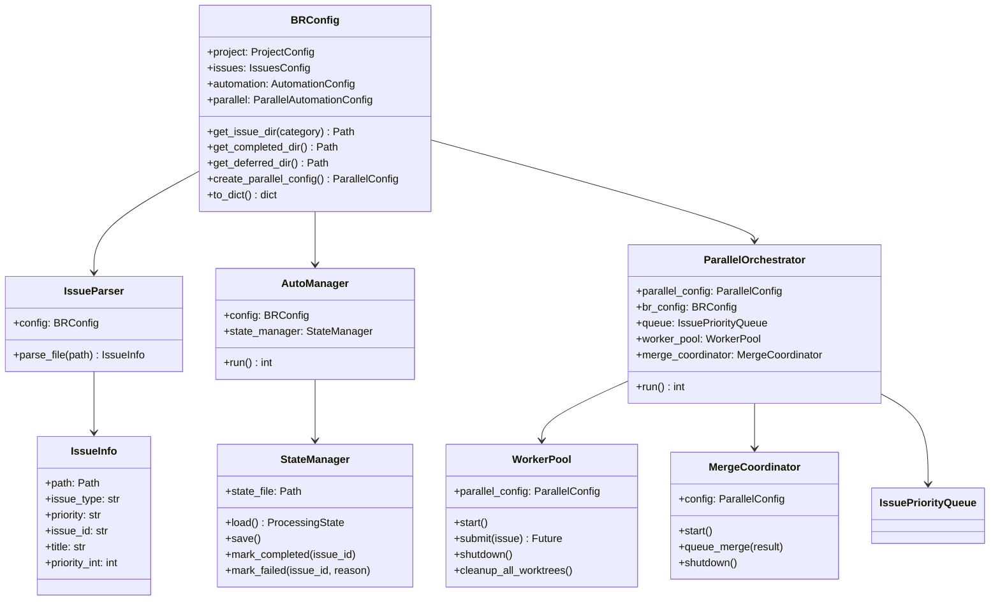
```mermaid
classDiagram
    class BRConfig {
        +project: ProjectConfig
        +issues: IssuesConfig
        +automation: AutomationConfig
        +parallel: ParallelAutomationConfig
        +get_issue_dir(category) Path
        +get_completed_dir() Path
        +get_deferred_dir() Path
        +create_parallel_config() ParallelConfig
        +to_dict() dict
    }

    class IssueParser {
        +config: BRConfig
        +parse_file(path) IssueInfo
    }

    class IssueInfo {
        +path: Path
        +issue_type: str
        +priority: str
        +issue_id: str
        +title: str
        +priority_int: int
    }

    class AutoManager {
        +config: BRConfig
        +state_manager: StateManager
        +run() int
    }

    class StateManager {
        +state_file: Path
        +load() ProcessingState
        +save()
        +mark_completed(issue_id)
        +mark_failed(issue_id, reason)
    }

    class ParallelOrchestrator {
        +parallel_config: ParallelConfig
        +br_config: BRConfig
        +queue: IssuePriorityQueue
        +worker_pool: WorkerPool
        +merge_coordinator: MergeCoordinator
        +run() int
    }

    class WorkerPool {
        +parallel_config: ParallelConfig
        +start()
        +submit(issue) Future
        +shutdown()
        +cleanup_all_worktrees()
    }

    class MergeCoordinator {
        +config: ParallelConfig
        +start()
        +queue_merge(result)
        +shutdown()
    }

    BRConfig --> IssueParser
    IssueParser --> IssueInfo
    BRConfig --> AutoManager
    AutoManager --> StateManager
    BRConfig --> ParallelOrchestrator
    ParallelOrchestrator --> WorkerPool
    ParallelOrchestrator --> MergeCoordinator
    ParallelOrchestrator --> IssuePriorityQueue
```

---

## Configuration Flow

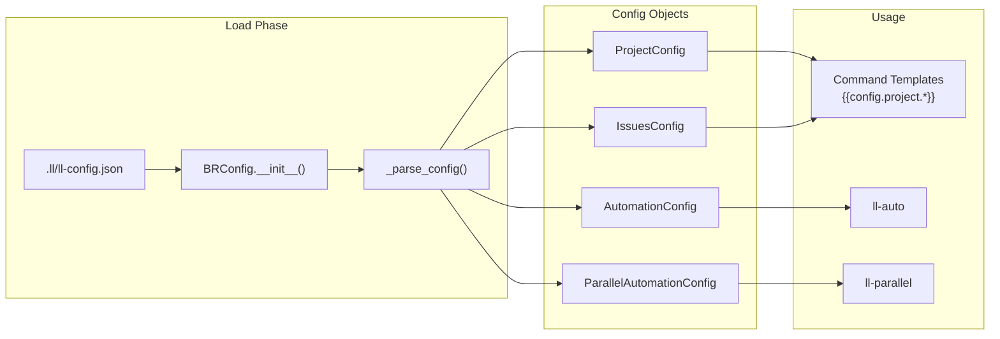
```mermaid
flowchart LR
    subgraph Load["Load Phase"]
        JSON[".ll/ll-config.json"]
        INIT["BRConfig.__init__()"]
        PARSE["_parse_config()"]
    end

    subgraph Objects["Config Objects"]
        PC[ProjectConfig]
        IC[IssuesConfig]
        AC[AutomationConfig]
        PAC[ParallelAutomationConfig]
    end

    subgraph Usage["Usage"]
        CMD["Command Templates<br/>{{config.project.*}}"]
        AUTO_CLI["ll-auto"]
        PAR_CLI["ll-parallel"]
    end

    JSON --> INIT
    INIT --> PARSE
    PARSE --> PC
    PARSE --> IC
    PARSE --> AC
    PARSE --> PAC
    PC --> CMD
    IC --> CMD
    AC --> AUTO_CLI
    PAC --> PAR_CLI
```

---

## Issue Processing Lifecycle

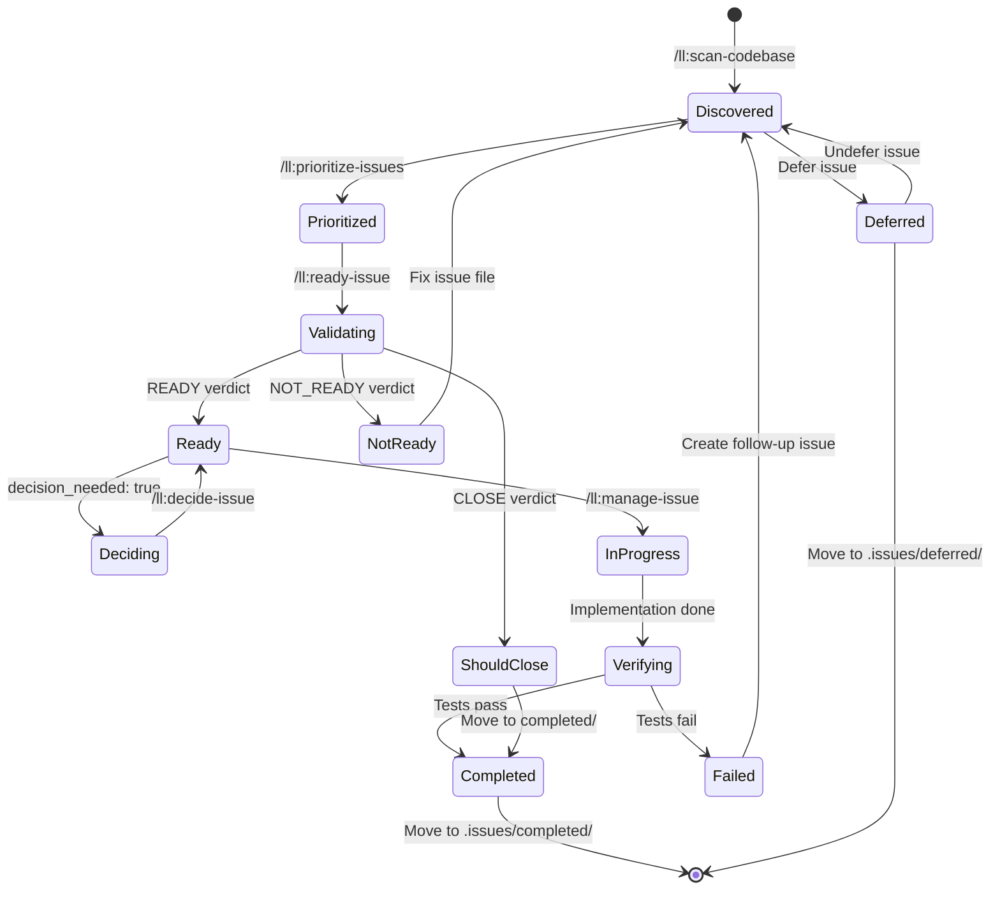
```mermaid
stateDiagram-v2
    [*] --> Discovered: /ll:scan-codebase

    Discovered --> Prioritized: /ll:prioritize-issues
    Prioritized --> Validating: /ll:ready-issue

    Validating --> Ready: READY verdict
    Validating --> NotReady: NOT_READY verdict
    Validating --> ShouldClose: CLOSE verdict

    Ready --> Deciding: decision_needed: true
    Deciding --> Ready: /ll:decide-issue
    Ready --> InProgress: /ll:manage-issue
    InProgress --> Verifying: Implementation done
    Verifying --> Completed: Tests pass
    Verifying --> Failed: Tests fail

    NotReady --> Discovered: Fix issue file
    ShouldClose --> Completed: Move to completed/
    Failed --> Discovered: Create follow-up issue
    Discovered --> Deferred: Defer issue
    Deferred --> Discovered: Undefer issue

    Completed --> [*]: Move to .issues/completed/
    Deferred --> [*]: Move to .issues/deferred/
```

---

## Priority Queue Design

The priority queue separates P0 (critical) issues for sequential processing while allowing P1-P5 to be processed in parallel.

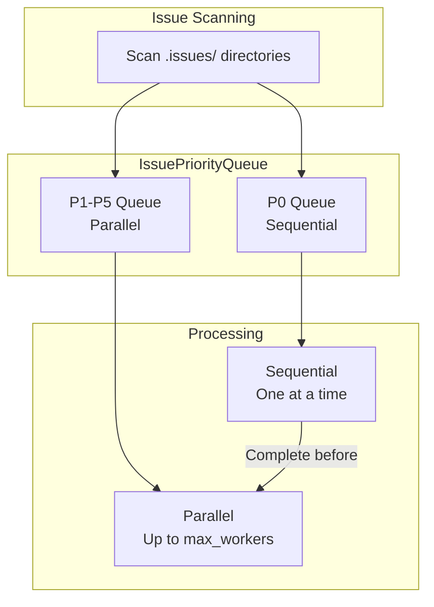
```mermaid
flowchart TB
    subgraph Input["Issue Scanning"]
        SCAN[Scan .issues/ directories]
    end

    subgraph Queue["IssuePriorityQueue"]
        P0Q[P0 Queue<br/>Sequential]
        PARQ[P1-P5 Queue<br/>Parallel]
    end

    subgraph Processing["Processing"]
        SEQ[Sequential<br/>One at a time]
        PAR[Parallel<br/>Up to max_workers]
    end

    SCAN --> P0Q
    SCAN --> PARQ

    P0Q --> SEQ
    PARQ --> PAR

    SEQ --> |Complete before| PAR
```

**Rationale**: P0 issues are critical and may have dependencies. Processing them sequentially ensures stability before parallel work begins.

---

## Sprint Mode (ll-sprint)

Sprint execution uses dependency-aware wave-based scheduling. Issues are grouped into waves where each wave contains issues whose blockers have all completed.

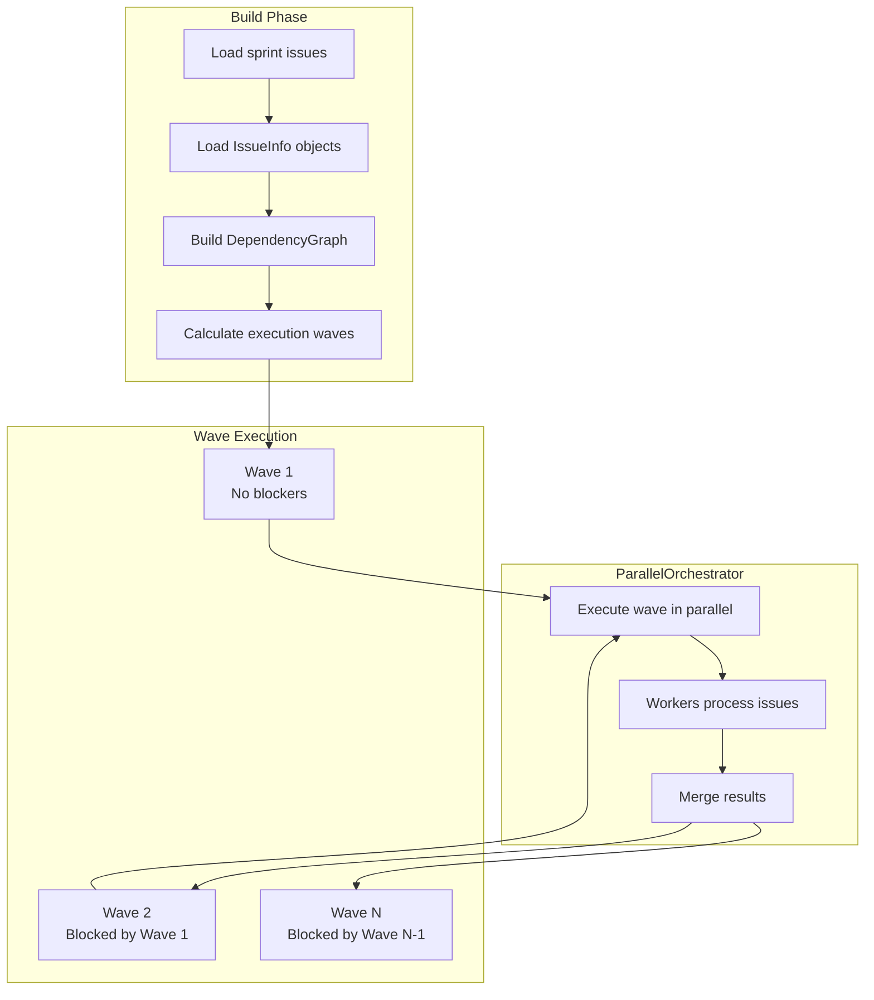
```mermaid
flowchart TB
    subgraph Build["Build Phase"]
        LOAD[Load sprint issues]
        INFO[Load IssueInfo objects]
        GRAPH[Build DependencyGraph]
        WAVES[Calculate execution waves]
    end

    subgraph Waves["Wave Execution"]
        W1[Wave 1<br/>No blockers]
        W2[Wave 2<br/>Blocked by Wave 1]
        W3[Wave N<br/>Blocked by Wave N-1]
    end

    subgraph Parallel["ParallelOrchestrator"]
        ORCH[Execute wave in parallel]
        WORKERS[Workers process issues]
        MERGE[Merge results]
    end

    LOAD --> INFO
    INFO --> GRAPH
    GRAPH --> WAVES
    WAVES --> W1
    W1 --> ORCH
    ORCH --> WORKERS
    WORKERS --> MERGE
    MERGE --> W2
    W2 --> ORCH
    MERGE --> W3
```

### Sprint Execution Flow

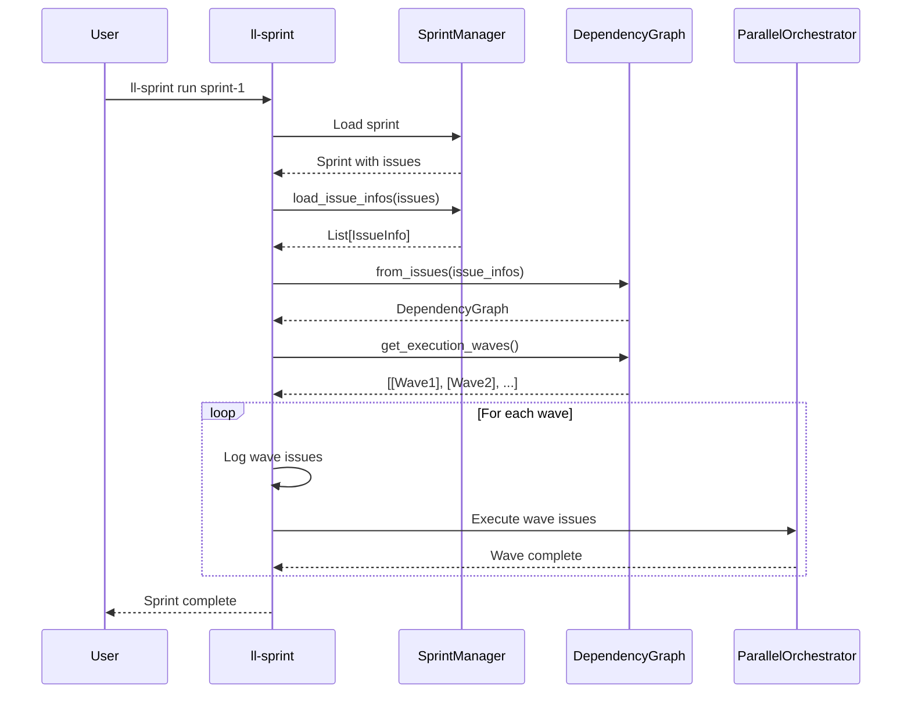
```mermaid
sequenceDiagram
    participant User
    participant CLI as ll-sprint
    participant Manager as SprintManager
    participant Graph as DependencyGraph
    participant Orch as ParallelOrchestrator

    User->>CLI: ll-sprint run sprint-1
    CLI->>Manager: Load sprint
    Manager-->>CLI: Sprint with issues

    CLI->>Manager: load_issue_infos(issues)
    Manager-->>CLI: List[IssueInfo]

    CLI->>Graph: from_issues(issue_infos)
    Graph-->>CLI: DependencyGraph

    CLI->>Graph: get_execution_waves()
    Graph-->>CLI: [[Wave1], [Wave2], ...]

    loop For each wave
        CLI->>CLI: Log wave issues
        CLI->>Orch: Execute wave issues
        Orch-->>CLI: Wave complete
    end

    CLI-->>User: Sprint complete
```

### Wave Calculation Example

Given issues with dependencies:
- `FEAT-001`: No blockers
- `BUG-001`: No blockers
- `FEAT-002`: Blocked by FEAT-001
- `FEAT-003`: Blocked by FEAT-001
- `FEAT-004`: Blocked by FEAT-002, FEAT-003

The `DependencyGraph.get_execution_waves()` returns:

| Wave | Issues | Reason |
|------|--------|--------|
| 1 | FEAT-001, BUG-001 | No blockers |
| 2 | FEAT-002, FEAT-003 | FEAT-001 completed in Wave 1 |
| 3 | FEAT-004 | FEAT-002, FEAT-003 completed in Wave 2 |

Issues within each wave execute in parallel. Waves execute sequentially.

### Dependency Discovery

The `dependency_mapper` module complements `dependency_graph` by discovering new dependency relationships:

- **dependency_graph.py**: Execution ordering from existing `Blocked By` data
- **dependency_mapper/**: Discovery of new relationships via file overlap + semantic conflict analysis (split into `models`, `analysis`, `formatting`, `operations` sub-modules)

The `/ll:map-dependencies` skill uses `dependency_mapper` to analyze active issues, propose dependencies based on shared file references, validate existing dependency integrity (broken refs, missing backlinks, cycles), and write approved relationships to issue files.

#### Semantic Conflict Analysis

When two issues reference the same file, the mapper goes beyond simple file overlap to determine whether they actually conflict. It computes a **conflict score** (0.0–1.0) from three signals:

1. **Semantic target overlap** (weight 0.5) — Extracts PascalCase component names, function references, and explicit scope mentions from issue content, then computes Jaccard similarity
2. **Section mention overlap** (weight 0.3) — Detects UI region keywords (header, body, sidebar, footer, card, modal, form) and checks if both issues target the same region
3. **Modification type match** (weight 0.2) — Classifies each issue as structural, infrastructure, or enhancement based on keyword matching

**Score thresholds:**
- **< 0.4**: Parallel-safe — issues touch different sections of the same file and can run concurrently
- **>= 0.4**: Dependency proposed — issues likely conflict and should be sequenced

**Same-priority ordering**: When two conflicting issues share the same priority, the mapper uses modification type to determine direction (structural → infrastructure → enhancement) rather than arbitrary ID ordering.

---

## Key Design Decisions

### Git Worktree Isolation

Each parallel worker operates in a separate git worktree:

```
.worktrees/
├── worker-1/           # Full repo copy
│   ├── src/
│   ├── tests/
│   └── .claude/
├── worker-2/
└── worker-N/
```

**Benefits**:
- No file conflicts between workers
- Each worker has isolated branch
- Clean rollback on failure

**Trade-offs**:
- Disk space usage (full copy per worker)
- Initial setup time for worktrees

### Sequential Merging

Despite parallel issue processing, merges happen one at a time:

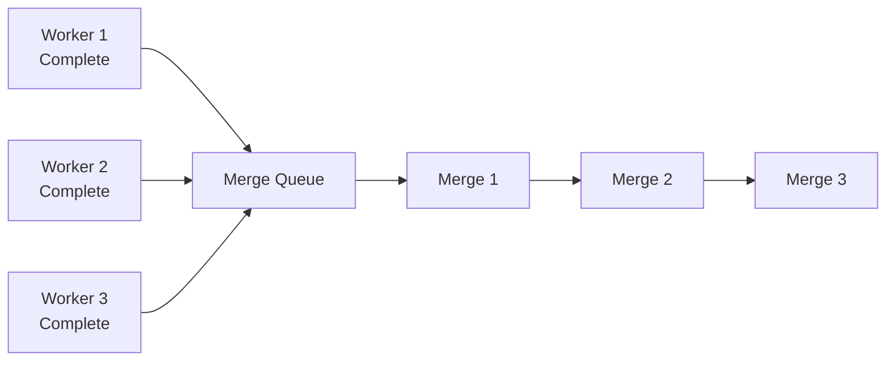
```mermaid
flowchart LR
    W1[Worker 1<br/>Complete] --> MQ[Merge Queue]
    W2[Worker 2<br/>Complete] --> MQ
    W3[Worker 3<br/>Complete] --> MQ

    MQ --> M1[Merge 1]
    M1 --> M2[Merge 2]
    M2 --> M3[Merge 3]
```

**Rationale**: Parallel merges would cause conflicts. Sequential merging with rebase-on-conflict ensures clean integration.

### State Persistence

Both modes save state for resume capability:

| Mode | State File | Contents |
|------|------------|----------|
| Sequential | `.auto-manage-state.json` | Current issue, completed list, failed list, timing |
| Parallel | `.parallel-manage-state.json` | In-progress, completed, failed, pending merges |

**Format**:
```json
{
  "completed_issues": ["BUG-001", "BUG-002"],
  "failed_issues": {"BUG-003": "Test failure"},
  "attempted_issues": ["BUG-001", "BUG-002", "BUG-003"],
  "timing": {
    "BUG-001": {"ready": 30.5, "implement": 120.2, "verify": 5.1}
  }
}
```

### Merge Strategy

The merge coordinator is a sophisticated git operations state machine that handles:
1. Sequential merge queue (one at a time to avoid conflicts)
2. Automatic stash/unstash of local changes with smart exclusions
3. Adaptive pull strategy (tracks problematic commits, switches to merge on repeat)
4. Index recovery (detects and repairs corrupted git state)
5. Lifecycle file coordination (auto-commits pending moves)
6. Conflict retry with rebase (up to `max_merge_retries` times)
7. Circuit breaker (pauses after consecutive failures)
8. Untracked file backup and retry

**See [MERGE-COORDINATOR.md](development/MERGE-COORDINATOR.md) for comprehensive documentation.**

### Context Monitor and Session Continuation

When context window limits approach, the system can automatically preserve work and spawn fresh sessions.

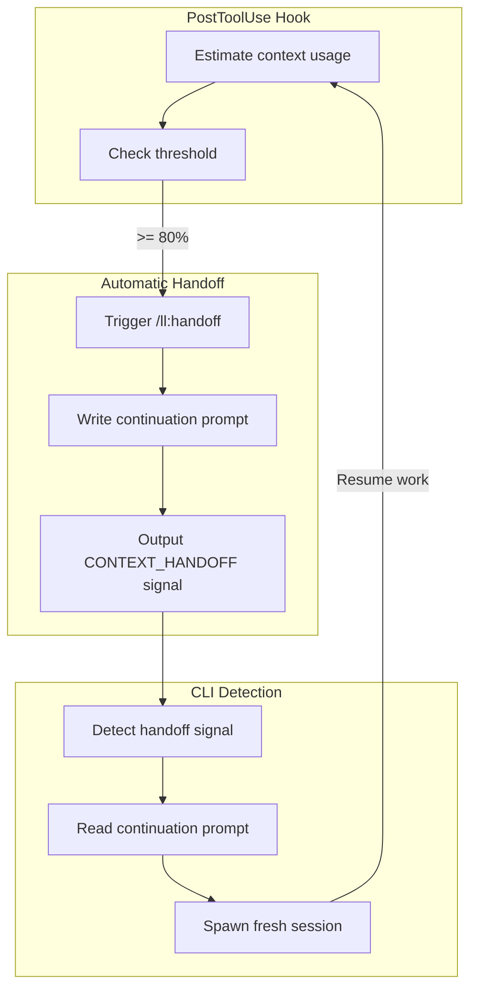
```mermaid
flowchart TB
    subgraph Hook["PostToolUse Hook"]
        ESTIMATE[Estimate context usage]
        CHECK[Check threshold]
    end

    subgraph Handoff["Automatic Handoff"]
        TRIGGER[Trigger /ll:handoff]
        WRITE[Write continuation prompt]
        SIGNAL[Output CONTEXT_HANDOFF signal]
    end

    subgraph CLI["CLI Detection"]
        DETECT[Detect handoff signal]
        READ[Read continuation prompt]
        SPAWN[Spawn fresh session]
    end

    ESTIMATE --> CHECK
    CHECK -->|>= 80%| TRIGGER
    TRIGGER --> WRITE
    WRITE --> SIGNAL
    SIGNAL --> DETECT
    DETECT --> READ
    READ --> SPAWN
    SPAWN --> |Resume work| ESTIMATE
```

**Context Estimation**: The hook estimates tokens based on tool usage:

| Tool | Estimation |
|------|------------|
| Read | `lines × 10 tokens` |
| Grep | `output_lines × 5 tokens` |
| Bash | `chars × 0.3 tokens` |
| Task | `2000 tokens` (summarized) |
| WebFetch | `1500 tokens` |
| Other | `100 tokens` base |

**Continuation Flow**:

1. **Hook triggers** at 80% estimated context usage (configurable)
2. **Handoff command** generates `.ll/ll-continue-prompt.md` with session state
3. **CLI tools** (`ll-auto`, `ll-parallel`) detect `CONTEXT_HANDOFF` signal in output
4. **Fresh session** spawned with continuation prompt
5. **Work continues** seamlessly from saved state

**Configuration** (enabled by default):
```json
{
  "context_monitor": {
    "enabled": true,
    "auto_handoff_threshold": 80,
    "context_limit_estimate": 1000000
  }
}
```

**Files**:
- `hooks/prompts/continuation-prompt-template.md` - Template for handoff prompts
- `.ll/ll-context-state.json` - Running context usage state
- `.ll/ll-continue-prompt.md` - Generated continuation prompt
- `subprocess_utils.py` - Handoff detection and continuation reading

### Session Log Auto-Linking

When an issue is moved to `.issues/completed/` via a `git mv` Bash call, a PostToolUse hook automatically appends a Session Log entry to the completed issue file. This ensures session logs are linked regardless of which path completed the issue.

**Trigger**: Any `Bash` tool call whose command matches `git mv .+ completed/`.

**Covered completion paths**:
- `manage-issue` skill (Phase 5)
- `ll-auto` (sequential batch)
- `ll-parallel` (concurrent worktree)
- `ll-sprint` (dependency-ordered)
- Manual `git mv` during a Claude session

**Implementation**:
- Hook script: `hooks/scripts/issue-completion-log.sh`
- Uses `little_loops.session_log.append_session_log_entry()` with source `hook:posttooluse-git-mv`
- Session JSONL path is read directly from the `transcript_path` field in the PostToolUse stdin payload

---

### Context Efficiency

> **Efficiency metric: tokens-per-task, not tokens-per-request.**

For ll-auto, ll-parallel, and ll-sprint, the correct optimization target is minimizing total tokens consumed per completed issue, not per individual turn. Over-aggressive compression that causes retries, re-reads, or error recovery is less efficient than a longer conversation that completes the task cleanly.

This principle is validated by published research on long-context LLM architectures (see `docs/research/LCM-Lossless-Context-Management.md`, Section 4.3): systems that aggressively chunk context introduce variance and error cascades, while systems that preserve working context through task completion achieve better reliability per token.

**Implications for compression decisions:**
- Compress at 80% context utilization (see `auto_handoff_threshold` in `### Context Monitor and Session Continuation`, above), not earlier
- Prefer keeping relevant tool outputs in context over re-fetching when needed again
- A failed task that restarts from scratch costs more tokens than a task that completes in a longer conversation

**Relationship to ENH-499**: The inter-issue context checkpoint (implemented in ENH-499) applies this principle at issue boundaries — it triggers a structured summarization reset rather than re-running tool calls to reconstruct state.

- **Skill pre-expansion** (`skill_expander.expand_skill`) eliminates the `ToolSearch → Skill` deferred-tool round-trip when `ll-auto` spawns Claude subprocesses: the full skill/command Markdown is read, config placeholders substituted, and the resulting self-contained prompt string is passed directly. This removes one tool call from every Phase 1 and Phase 2 invocation.

---

## Data Flow Summary

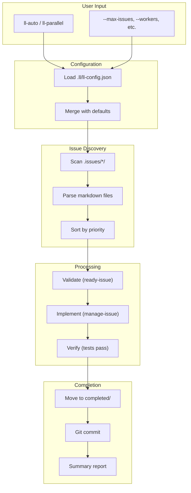
```mermaid
flowchart TB
    subgraph User["User Input"]
        CMD_INPUT["ll-auto / ll-parallel"]
        FLAGS["--max-issues, --workers, etc."]
    end

    subgraph Config["Configuration"]
        LOAD["Load .ll/ll-config.json"]
        MERGE_CFG["Merge with defaults"]
    end

    subgraph Discovery["Issue Discovery"]
        SCAN["Scan .issues/*/"]
        PARSE["Parse markdown files"]
        SORT["Sort by priority"]
    end

    subgraph Processing["Processing"]
        VALIDATE["Validate (ready-issue)"]
        IMPLEMENT["Implement (manage-issue)"]
        VERIFY["Verify (tests pass)"]
    end

    subgraph Completion["Completion"]
        MOVE["Move to completed/"]
        COMMIT["Git commit"]
        REPORT["Summary report"]
    end

    CMD_INPUT --> LOAD
    FLAGS --> LOAD
    LOAD --> MERGE_CFG
    MERGE_CFG --> SCAN
    SCAN --> PARSE
    PARSE --> SORT
    SORT --> VALIDATE
    VALIDATE --> IMPLEMENT
    IMPLEMENT --> VERIFY
    VERIFY --> MOVE
    MOVE --> COMMIT
    COMMIT --> REPORT
```