> ## Documentation Index
> Fetch the complete documentation index at: https://code.claude.com/docs/llms.txt
> Use this file to discover all available pages before exploring further.

# Write a little-loops hook

> Author a host-agnostic hook intent once in Python, then run it from Claude Code, OpenCode, or any other agent host that ships an adapter. This guide walks through the intent model, the handler signature, registration via an extension, the adapter flow, and testing patterns.

little-loops separates *what a hook does* from *which host invoked it*. A hook intent is a small Python function that takes an `LLHookEvent` and returns an `LLHookResult`. Per-host adapters (a bash shim for Claude Code, a TypeScript plugin for OpenCode) translate the host's native hook payload into that wire format, invoke the dispatcher, and translate the result back into whatever response shape the host expects. The handler itself never imports anything host-specific.

<Tip>
  This is the authoring walkthrough. For the wire-format field reference (`LLHookEvent` / `LLHookResult` field tables, exit-code semantics, JSON keys), see [EVENT-SCHEMA.md — Hook intents](../reference/EVENT-SCHEMA.md#hook-intents--sibling-type); the canonical dataclass definitions live in [`scripts/little_loops/hooks/types.py`](../../scripts/little_loops/hooks/types.py). For the related Claude Code lifecycle and matcher reference, see [Automate workflows with hooks](automate-workflows-with-hooks.md).
</Tip>

## The intent model

A hook intent has exactly two values on the wire:

- **In:** `LLHookEvent` — what the host did and the payload it carried.
- **Out:** `LLHookResult` — what the host should do next (proceed, block, inject feedback).

### `LLHookEvent` fields

Defined in `scripts/little_loops/hooks/types.py`:

| Field        | Type                | Notes                                                                            |
| :----------- | :------------------ | :------------------------------------------------------------------------------- |
| `host`       | `str`               | Host identifier — `"claude-code"`, `"opencode"`, `"codex"`, etc. Set by the adapter. |
| `intent`     | `str`               | Hook intent name (e.g. `"pre_compact"`, `"session_start"`).                      |
| `timestamp`  | `str`               | ISO 8601 UTC; serialized to the wire key `"ts"`.                                 |
| `payload`    | `dict[str, Any]`    | Host-supplied event data. Schema is intent-specific.                             |
| `session_id` | `str \| None`       | Host session identifier when available.                                          |
| `cwd`        | `str \| None`       | Working directory the host was operating in.                                     |

`LLHookEvent.from_dict` accepts both the wire key `"ts"` and the field-name alias `"timestamp"`, so adapters can emit whichever they prefer.

### `LLHookResult` fields

| Field       | Type                | Notes                                                                                        |
| :---------- | :------------------ | :------------------------------------------------------------------------------------------- |
| `exit_code` | `int`               | `0` = pass, `2` = block + inject `feedback`, any other = error.                              |
| `feedback`  | `str \| None`       | Human-readable message; written to stderr by the dispatcher when present.                    |
| `decision`  | `str \| None`       | Optional permission decision (`"allow"`, `"deny"`, `"ask"`) for permission-style intents.    |
| `data`      | `dict[str, Any]`    | Additional structured data for the host. Empty dict by default.                              |
| `stdout`    | `str \| None`       | Raw bytes to write to the host's stdout stream (e.g. SessionStart's merged config JSON).     |

Exit-code semantics are borrowed from the Claude Code shell-hook contract: `0` lets the action proceed, `2` blocks it and surfaces `feedback` to the model as stderr. Other hosts map these to their own permit/deny semantics in the adapter layer.

## Handler signature

Every intent handler has the same signature:

```python
from little_loops.hooks.types import LLHookEvent, LLHookResult


def handle(event: LLHookEvent) -> LLHookResult:
    if event.payload.get("danger"):
        return LLHookResult(exit_code=2, feedback="blocked: dangerous payload")
    return LLHookResult(exit_code=0)
```

The dispatcher reads stdin, builds the `LLHookEvent`, calls `handle(event)`, writes `result.stdout` to stdout and `result.feedback` to stderr, and exits with `result.exit_code`. Your handler is pure Python — no shell, no JSON parsing, no host quirks.

## Core handler vs. extension intent

little-loops has two registration paths for hook intents:

| Path                       | Where it lives                                  | When to use                                                                                                  |
| :------------------------- | :---------------------------------------------- | :----------------------------------------------------------------------------------------------------------- |
| **Core handler**           | `scripts/little_loops/hooks/<intent>.py`        | Hooks shipped with little-loops itself (built-ins like `pre_compact`, `session_start`).                      |
| **Extension intent**       | A package that implements `LLHookIntentExtension` | Third-party packages and out-of-tree workflows. Auto-discovered via the `little_loops.extensions` entry point. |

Built-ins shadow extension-provided intents on name collision: the dispatch table is `{**_HOOK_INTENT_REGISTRY, **built_ins}`, so any built-in with the same intent name wins. Pick a unique name for your extension intent to avoid surprises.

If you're adding a hook that should ship as part of little-loops itself, add a module under `scripts/little_loops/hooks/` and wire it into the `built_ins` dispatch table in `scripts/little_loops/hooks/__init__.py`. The rest of this guide focuses on the extension path, which is the right answer for everyone else.

## Step-by-step: register a new intent

<Steps>
  <Step title="Scaffold the extension package">
    Use [`ll-create-extension`](../reference/CLI.md#ll-create-extension) to generate a ready-to-install Python package with an `LLExtension` skeleton, a `pyproject.toml` registered under the `little_loops.extensions` entry point, and a starter test using `LLTestBus`:

    ```bash
    ll-create-extension my-hook-ext
    cd my-hook-ext
    ```

    The scaffold gives you `my_hook_ext/extension.py` (the implementation stub) and `pyproject.toml` (entry-point wiring).
  </Step>

  <Step title="Implement the handler">
    Add a `handle` function for your intent. Keep it pure — no shell-outs, no host imports.

    ```python
    # my_hook_ext/extension.py
    from little_loops.hooks.types import LLHookEvent, LLHookResult


    def handle_count_files(event: LLHookEvent) -> LLHookResult:
        cwd = event.cwd or "."
        from pathlib import Path
        count = sum(1 for _ in Path(cwd).rglob("*.py"))
        return LLHookResult(exit_code=0, feedback=f"{count} Python files in {cwd}")
    ```
  </Step>

  <Step title="Implement `provided_hook_intents` on your extension class">
    The `LLHookIntentExtension` Protocol is detected via `hasattr()` in `wire_extensions()`. Implement `provided_hook_intents` to return a mapping of intent name → handler:

    ```python
    # my_hook_ext/extension.py (continued)
    from collections.abc import Callable
    from little_loops.events import LLEvent


    class MyHookExt:
        def on_event(self, event: LLEvent) -> None:
            pass  # required by LLExtension; no-op for hook-only extensions

        def provided_hook_intents(
            self,
        ) -> dict[str, Callable[[LLHookEvent], LLHookResult]]:
            return {"count_files": handle_count_files}
    ```

    The Protocol itself (`scripts/little_loops/extension.py:103-111`):

    ```python
    @runtime_checkable
    class LLHookIntentExtension(Protocol):
        def provided_hook_intents(
            self,
        ) -> dict[str, Callable[[LLHookEvent], LLHookResult]]: ...
    ```

    `wire_extensions()` walks every loaded extension that exposes `provided_hook_intents` and merges the returned handlers into `_HOOK_INTENT_REGISTRY`. Duplicate intent names across extensions raise `ValueError` at wire time.
  </Step>

  <Step title="Wire the entry point">
    `ll-create-extension` already added a `little_loops.extensions` entry point to `pyproject.toml`. Confirm it points at your extension class:

    ```toml
    [project.entry-points."little_loops.extensions"]
    my-hook-ext = "my_hook_ext.extension:MyHookExt"
    ```

    Auto-discovery uses `importlib.metadata.entry_points(group="little_loops.extensions")`; each entry-point class is instantiated with `cls()` (no constructor arguments).
  </Step>

  <Step title="Install and verify">
    Install your extension into the same Python interpreter that little-loops runs from:

    ```bash
    pip install -e .
    python -m little_loops.hooks count_files <<< '{}'
    ```

    If the intent name is unrecognized, the dispatcher prints `Unknown intent: <name>. Available: ...` to stderr and exits with code `1` — use the listing it prints to confirm your handler is registered.
  </Step>
</Steps>

## Adapter flow

```mermaid
flowchart LR
    HOST[Host event<br/>Claude Code or OpenCode] --> ADAPTER[Adapter<br/>bash shim or TS plugin]
    ADAPTER --> SUBPROC[python -m little_loops.hooks &lt;intent&gt;]
    SUBPROC --> MAIN[main_hooks dispatch]
    MAIN --> HANDLER[handle&#40;event&#41;]
    HANDLER --> RESULT[LLHookResult]
    RESULT --> ADAPTERBACK[Adapter]
    ADAPTERBACK --> HOSTBACK[Host response]
```

A hook intent never sees the host's native event shape. Each adapter takes the host event, serializes it to JSON, pipes it to `python -m little_loops.hooks <intent>`, and translates the dispatcher's response back into whatever the host expects.



The three concrete adapters:

- **Claude Code** (`hooks/adapters/claude-code/*.sh`) — a one-line bash shim that reads stdin and pipes it through the Python dispatcher. Registered in `hooks/hooks.json` as `bash ${CLAUDE_PLUGIN_ROOT}/hooks/adapters/claude-code/<intent>.sh`. Does not set `LL_HOOK_HOST`, so the dispatcher defaults `LLHookEvent.host` to `"claude-code"`. Adapter files: `precompact.sh`, `post-tool-use.sh`, `session-end.sh`, `session-start.sh`.

  ```bash
  INPUT=$(cat)
  echo "$INPUT" | python -m little_loops.hooks pre_compact
  exit $?
  ```

- **OpenCode** (`hooks/adapters/opencode/index.ts`) — a `Bun.spawn(["python", "-m", "little_loops.hooks", intent], { cwd, env: { ...process.env, LL_HOOK_HOST: "opencode" } })` call that writes `JSON.stringify(payload)` to stdin and awaits stdout/stderr/exit. See [`hooks/adapters/opencode/README.md`](../../hooks/adapters/opencode/README.md) for the full subprocess contract, including the latency budget that gates hot-path intents.

- **Codex CLI** (`hooks/adapters/codex/{session-start,pre-compact}.sh`) — a bash shim that exports `LL_HOOK_HOST=codex` before piping stdin into `python -m little_loops.hooks <intent>`. Registered by `/ll:init --codex` in the user project's `.codex/hooks.json` from the [`hooks.json`](../../hooks/adapters/codex/hooks.json) template. The SessionStart MatcherGroup uses `"matcher": "startup"` to avoid re-emitting identifiers on Codex's `resume`/`clear` session variants. See [`hooks/adapters/codex/README.md`](../../hooks/adapters/codex/README.md) for the trust-model and trust-hash-churn guidance.

  ```bash
  export LL_HOOK_HOST=codex
  INPUT=$(cat)
  echo "$INPUT" | python -m little_loops.hooks session_start
  exit $?
  ```

The dispatcher reads `LL_HOOK_HOST` from the environment to set `LLHookEvent.host`, defaulting to `"claude-code"` when the variable is unset (which is what the Claude Code bash shim relies on).

## Testing pattern

Two layers of tests cover hook intents. Write the pure-function tests first; reach for the subprocess round-trip when you specifically need to verify the dispatcher wiring or the adapter contract.

### Pure-function unit test

Call `handle` directly. Use `monkeypatch.chdir(tmp_path)` if your handler resolves paths relative to `cwd`. Modeled on `scripts/tests/test_pre_compact.py`:

```python
from pathlib import Path
import pytest
from little_loops.hooks.types import LLHookEvent, LLHookResult
from my_hook_ext.extension import handle_count_files


def _event(**payload: object) -> LLHookEvent:
    return LLHookEvent(host="claude-code", intent="count_files", payload=dict(payload))


def test_count_files_reports_python_count(
    tmp_path: Path, monkeypatch: pytest.MonkeyPatch
) -> None:
    (tmp_path / "a.py").write_text("")
    (tmp_path / "b.py").write_text("")
    monkeypatch.chdir(tmp_path)

    result = handle_count_files(_event())

    assert isinstance(result, LLHookResult)
    assert result.exit_code == 0
    assert result.feedback is not None
    assert "2 Python files" in result.feedback
```

This layer is fast, gives precise error messages, and doesn't depend on the entry-point wiring.

### Subprocess round-trip

Verify the full dispatcher path end-to-end. Modeled on `scripts/tests/test_hooks_integration.py`:

```python
import json
import subprocess
import sys
from pathlib import Path


def test_count_files_via_dispatcher(tmp_path: Path) -> None:
    (tmp_path / "a.py").write_text("")

    result = subprocess.run(
        [sys.executable, "-m", "little_loops.hooks", "count_files"],
        input=json.dumps({}),
        capture_output=True,
        text=True,
        timeout=10,
        cwd=str(tmp_path),
    )

    assert result.returncode == 0
    assert "1 Python files" in result.stderr
```

This layer catches entry-point registration regressions, intent-name collisions with built-ins, and stdin/stdout/stderr plumbing bugs that the pure-function test cannot see.

## Worked example: `count_files`

Putting it together end-to-end. After scaffolding with `ll-create-extension my-hook-ext`:

`my_hook_ext/extension.py`:

```python
from collections.abc import Callable
from pathlib import Path

from little_loops.events import LLEvent
from little_loops.hooks.types import LLHookEvent, LLHookResult


def handle_count_files(event: LLHookEvent) -> LLHookResult:
    cwd = event.cwd or "."
    count = sum(1 for _ in Path(cwd).rglob("*.py"))
    return LLHookResult(exit_code=0, feedback=f"{count} Python files in {cwd}")


class MyHookExt:
    def on_event(self, event: LLEvent) -> None:
        pass

    def provided_hook_intents(
        self,
    ) -> dict[str, Callable[[LLHookEvent], LLHookResult]]:
        return {"count_files": handle_count_files}
```

`pyproject.toml` (relevant fragment):

```toml
[project.entry-points."little_loops.extensions"]
my-hook-ext = "my_hook_ext.extension:MyHookExt"
```

Install and exercise the intent:

```bash
pip install -e .
echo '{}' | python -m little_loops.hooks count_files
```

You should see something like `45 Python files in /Users/you/my-hook-ext` on stderr and exit code `0`.

## Limitations and troubleshooting

- **Unknown intent → exit `1`.** If the dispatcher prints `Unknown intent: <name>. Available: ...`, your handler isn't in the dispatch table. Confirm the entry-point fence in `pyproject.toml` and re-run `pip install -e .`.
- **Built-in shadowing.** Built-ins win on name collision (`_dispatch_table()` merge order). Avoid intent names that match those listed by `python -m little_loops.hooks unknown_intent_for_listing 2>&1`.
- **`LL_HOOK_HOST` defaults.** The Claude Code bash shim does not set this; the dispatcher defaults `LLHookEvent.host` to `"claude-code"`. The OpenCode TS adapter sets `LL_HOOK_HOST=opencode` explicitly, and the Codex CLI bash shim sets `LL_HOOK_HOST=codex` explicitly. Don't rely on `event.host` to disambiguate hosts unless you've audited every adapter that calls your intent.
- **Hot-path intent status.** `tool.execute.after` is wired fire-and-forget on OpenCode (and as a 5s-timeout blocking shim on Codex) per FEAT-1489. `tool.execute.before` is opt-in only — the `pre_tool_use` handler is registered, but the adapter event mapping is not added by default. See `hooks/adapters/opencode/README.md` and `hooks/adapters/codex/README.md` for the opt-in steps; the measured cold-start p95 (~10ms) sits well below the 200ms target so a synchronous pre-tool handler is viable when opted in.
- **`stdout` writes are raw.** The dispatcher writes `result.stdout` verbatim to the host's stdout. For Claude Code's `SessionStart`, that's the merged config JSON consumed as session context. Don't `print()` inside your handler — return the bytes on `LLHookResult.stdout` instead.

## Learn more

- [`ll-create-extension`](../reference/CLI.md#ll-create-extension) — scaffold a new extension repo with entry-point wiring and a starter `LLTestBus` test.
- [Automate workflows with hooks](automate-workflows-with-hooks.md) — Claude Code's hook lifecycle, matchers, and configuration scopes.
- [`hooks/adapters/opencode/README.md`](../../hooks/adapters/opencode/README.md) — OpenCode adapter subprocess contract and event-to-intent mapping.
- [`hooks/adapters/codex/README.md`](../../hooks/adapters/codex/README.md) — Codex CLI adapter subprocess contract, event-to-intent mapping, and trust-model note.
- [`docs/reference/HOST_COMPATIBILITY.md`](../reference/HOST_COMPATIBILITY.md) — host parity matrix (which intents are wired where).
- [`scripts/little_loops/hooks/types.py`](../../scripts/little_loops/hooks/types.py) — `LLHookEvent` / `LLHookResult` dataclasses (wire-format source of truth).
- [`scripts/little_loops/extension.py`](../../scripts/little_loops/extension.py) — `LLHookIntentExtension` Protocol and the `wire_extensions()` discovery flow.
